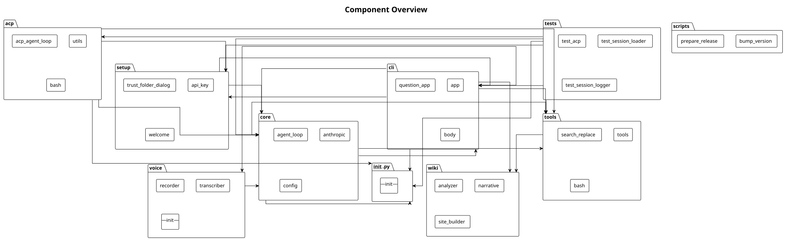

# Component Overview

The mistral-vibe system is organised into 10 subsystems that interact through well-defined import boundaries.

## Subsystem Interactions

The **acp** subsystem depends on **__init__.py**, **core**, **setup**, **tools**.

The **cli** subsystem depends on **__init__.py**, **core**, **setup**, **tools**, **voice**, **wiki**.

The **core** subsystem depends on **__init__.py**, **cli**, **tools**.

The **setup** subsystem depends on **cli**, **core**.

The **tests** subsystem depends on **__init__.py**, **acp**, **cli**, **core**, **setup**, **tools**.

The **tools** subsystem depends on **core**, **wiki**.

The **voice** subsystem depends on **core**.

