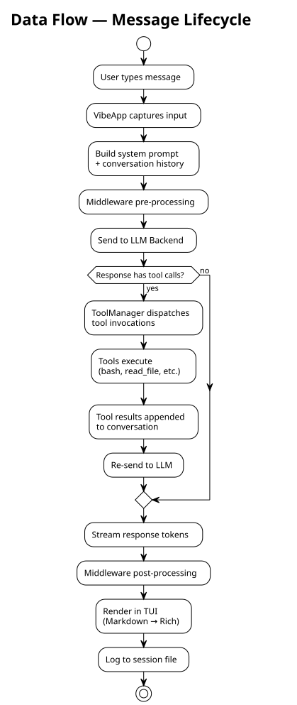
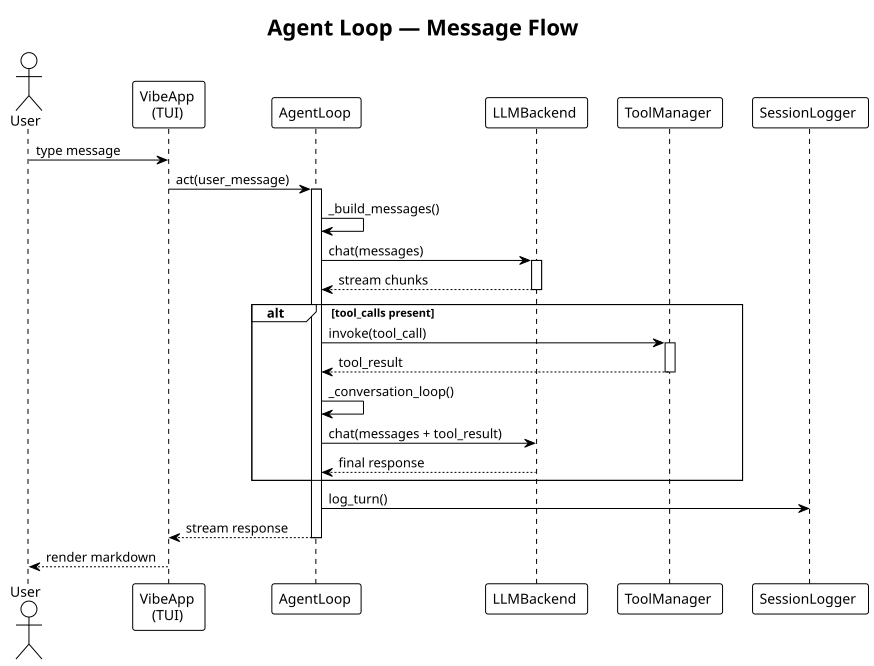

# Data Flow

This section describes the lifecycle of a user message as it flows through the Vibe system, from initial input to final response.

## Message Lifecycle

## Agent Loop Sequence

## Key Stages

The message lifecycle proceeds through eight stages. First, **user input** is captured by the Textual TUI. The **system prompt** is then assembled from conversation history and system instructions. **Middleware pre-processing** transforms the messages before the **LLM invocation**, which streams the request to the configured backend (Mistral, Anthropic, etc.). If the response contains tool calls, the **tool dispatch** phase hands them to `ToolManager` for execution. The **conversation loop** feeds tool results back to the LLM for continued reasoning. Finally, **response rendering** displays the Markdown via Rich in the TUI, and **session logging** persists the full turn to the session JSONL file.
