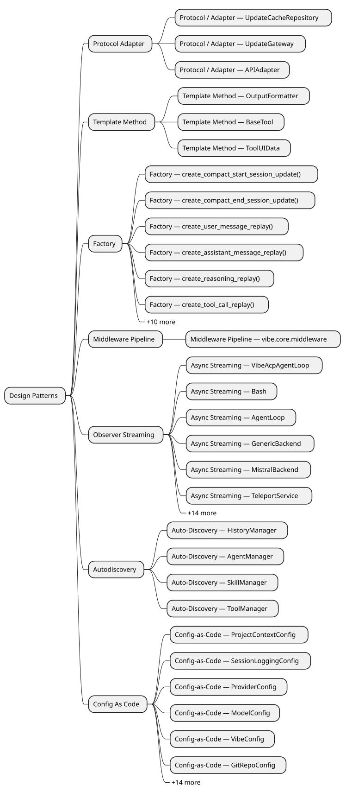

# Design Patterns

## Autodiscovery

**Auto-Discovery — HistoryManager**

`HistoryManager` auto-discovers plugins via `_load_history()`. This pattern is implemented in [**history_manager.py**](https://github.com/ibrahimgb/mistral-vibe/blob/87fd92fb12b535b705a6f815cddb938721e9215d/vibe/cli/history_manager.py).

**Auto-Discovery — AgentManager**

`AgentManager` auto-discovers plugins via `register_agent()`, `_discover_agents()`, `_try_load_agent()`. This pattern is implemented in [**manager.py**](https://github.com/ibrahimgb/mistral-vibe/blob/87fd92fb12b535b705a6f815cddb938721e9215d/vibe/core/agents/manager.py).

**Auto-Discovery — SkillManager**

`SkillManager` auto-discovers plugins via `_discover_skills()`, `_discover_skills_in_dir()`, `_try_load_skill()`. This pattern is implemented in [**manager.py**](https://github.com/ibrahimgb/mistral-vibe/blob/87fd92fb12b535b705a6f815cddb938721e9215d/vibe/core/skills/manager.py).

**Auto-Discovery — ToolManager**

`ToolManager` auto-discovers plugins via `_iter_tool_classes()`, `_load_tools_from_file()`, `discover_tool_defaults()`. This pattern is implemented in [**manager.py**](https://github.com/ibrahimgb/mistral-vibe/blob/87fd92fb12b535b705a6f815cddb938721e9215d/vibe/core/tools/manager.py).

## Config As Code

**Config-as-Code — ProjectContextConfig**

`ProjectContextConfig` in `vibe.core.config` uses Pydantic for typed configuration with 8 field(s). This pattern is implemented in [**config.py**](https://github.com/ibrahimgb/mistral-vibe/blob/87fd92fb12b535b705a6f815cddb938721e9215d/vibe/core/config.py).

**Config-as-Code — SessionLoggingConfig**

`SessionLoggingConfig` in `vibe.core.config` uses Pydantic for typed configuration with 3 field(s). This pattern is implemented in [**config.py**](https://github.com/ibrahimgb/mistral-vibe/blob/87fd92fb12b535b705a6f815cddb938721e9215d/vibe/core/config.py).

**Config-as-Code — ProviderConfig**

`ProviderConfig` in `vibe.core.config` uses Pydantic for typed configuration with 8 field(s). This pattern is implemented in [**config.py**](https://github.com/ibrahimgb/mistral-vibe/blob/87fd92fb12b535b705a6f815cddb938721e9215d/vibe/core/config.py).

**Config-as-Code — ModelConfig**

`ModelConfig` in `vibe.core.config` uses Pydantic for typed configuration with 7 field(s). This pattern is implemented in [**config.py**](https://github.com/ibrahimgb/mistral-vibe/blob/87fd92fb12b535b705a6f815cddb938721e9215d/vibe/core/config.py).

**Config-as-Code — VibeConfig**

`VibeConfig` in `vibe.core.config` uses Pydantic for typed configuration with 39 field(s). This pattern is implemented in [**config.py**](https://github.com/ibrahimgb/mistral-vibe/blob/87fd92fb12b535b705a6f815cddb938721e9215d/vibe/core/config.py).

**Config-as-Code — GitRepoConfig**

`GitRepoConfig` in `vibe.core.teleport.nuage` uses Pydantic for typed configuration with 3 field(s). This pattern is implemented in [**nuage.py**](https://github.com/ibrahimgb/mistral-vibe/blob/87fd92fb12b535b705a6f815cddb938721e9215d/vibe/core/teleport/nuage.py).

**Config-as-Code — VibeSandboxConfig**

`VibeSandboxConfig` in `vibe.core.teleport.nuage` uses Pydantic for typed configuration with 1 field(s). This pattern is implemented in [**nuage.py**](https://github.com/ibrahimgb/mistral-vibe/blob/87fd92fb12b535b705a6f815cddb938721e9215d/vibe/core/teleport/nuage.py).

**Config-as-Code — BaseToolConfig**

`BaseToolConfig` in `vibe.core.tools.base` uses Pydantic for typed configuration with 4 field(s). This pattern is implemented in [**base.py**](https://github.com/ibrahimgb/mistral-vibe/blob/87fd92fb12b535b705a6f815cddb938721e9215d/vibe/core/tools/base.py).

**Config-as-Code — AskUserQuestionConfig**

`AskUserQuestionConfig` in `vibe.core.tools.builtins.ask_user_question` uses Pydantic for typed configuration with 1 field(s). This pattern is implemented in [**ask_user_question.py**](https://github.com/ibrahimgb/mistral-vibe/blob/87fd92fb12b535b705a6f815cddb938721e9215d/vibe/core/tools/builtins/ask_user_question.py).

**Config-as-Code — BashToolConfig**

`BashToolConfig` in `vibe.core.tools.builtins.bash` uses Pydantic for typed configuration with 6 field(s). This pattern is implemented in [**bash.py**](https://github.com/ibrahimgb/mistral-vibe/blob/87fd92fb12b535b705a6f815cddb938721e9215d/vibe/core/tools/builtins/bash.py).

**Config-as-Code — GrepToolConfig**

`GrepToolConfig` in `vibe.core.tools.builtins.grep` uses Pydantic for typed configuration with 6 field(s). This pattern is implemented in [**grep.py**](https://github.com/ibrahimgb/mistral-vibe/blob/87fd92fb12b535b705a6f815cddb938721e9215d/vibe/core/tools/builtins/grep.py).

**Config-as-Code — ReadFileToolConfig**

`ReadFileToolConfig` in `vibe.core.tools.builtins.read_file` uses Pydantic for typed configuration with 2 field(s). This pattern is implemented in [**read_file.py**](https://github.com/ibrahimgb/mistral-vibe/blob/87fd92fb12b535b705a6f815cddb938721e9215d/vibe/core/tools/builtins/read_file.py).

**Config-as-Code — SearchReplaceConfig**

`SearchReplaceConfig` in `vibe.core.tools.builtins.search_replace` uses Pydantic for typed configuration with 3 field(s). This pattern is implemented in [**search_replace.py**](https://github.com/ibrahimgb/mistral-vibe/blob/87fd92fb12b535b705a6f815cddb938721e9215d/vibe/core/tools/builtins/search_replace.py).

**Config-as-Code — TaskToolConfig**

`TaskToolConfig` in `vibe.core.tools.builtins.task` uses Pydantic for typed configuration with 2 field(s). This pattern is implemented in [**task.py**](https://github.com/ibrahimgb/mistral-vibe/blob/87fd92fb12b535b705a6f815cddb938721e9215d/vibe/core/tools/builtins/task.py).

**Config-as-Code — TodoConfig**

`TodoConfig` in `vibe.core.tools.builtins.todo` uses Pydantic for typed configuration with 2 field(s). This pattern is implemented in [**todo.py**](https://github.com/ibrahimgb/mistral-vibe/blob/87fd92fb12b535b705a6f815cddb938721e9215d/vibe/core/tools/builtins/todo.py).

**Config-as-Code — WebFetchConfig**

`WebFetchConfig` in `vibe.core.tools.builtins.webfetch` uses Pydantic for typed configuration with 5 field(s). This pattern is implemented in [**webfetch.py**](https://github.com/ibrahimgb/mistral-vibe/blob/87fd92fb12b535b705a6f815cddb938721e9215d/vibe/core/tools/builtins/webfetch.py).

**Config-as-Code — WebSearchConfig**

`WebSearchConfig` in `vibe.core.tools.builtins.websearch` uses Pydantic for typed configuration with 3 field(s). This pattern is implemented in [**websearch.py**](https://github.com/ibrahimgb/mistral-vibe/blob/87fd92fb12b535b705a6f815cddb938721e9215d/vibe/core/tools/builtins/websearch.py).

**Config-as-Code — WikiDiagramConfig**

`WikiDiagramConfig` in `vibe.core.tools.builtins.wiki_diagram` uses Pydantic for typed configuration with 3 field(s). This pattern is implemented in [**wiki_diagram.py**](https://github.com/ibrahimgb/mistral-vibe/blob/87fd92fb12b535b705a6f815cddb938721e9215d/vibe/core/tools/builtins/wiki_diagram.py).

**Config-as-Code — WikiDocConfig**

`WikiDocConfig` in `vibe.core.tools.builtins.wiki_doc` uses Pydantic for typed configuration with 1 field(s). This pattern is implemented in [**wiki_doc.py**](https://github.com/ibrahimgb/mistral-vibe/blob/87fd92fb12b535b705a6f815cddb938721e9215d/vibe/core/tools/builtins/wiki_doc.py).

**Config-as-Code — WriteFileConfig**

`WriteFileConfig` in `vibe.core.tools.builtins.write_file` uses Pydantic for typed configuration with 3 field(s). This pattern is implemented in [**write_file.py**](https://github.com/ibrahimgb/mistral-vibe/blob/87fd92fb12b535b705a6f815cddb938721e9215d/vibe/core/tools/builtins/write_file.py).

## Factory

**Factory — create_compact_start_session_update()**

`create_compact_start_session_update()` in `vibe.acp.utils` creates `ToolCallStart`. This pattern is implemented in [**utils.py**](https://github.com/ibrahimgb/mistral-vibe/blob/87fd92fb12b535b705a6f815cddb938721e9215d/vibe/acp/utils.py).

**Factory — create_compact_end_session_update()**

`create_compact_end_session_update()` in `vibe.acp.utils` creates `ToolCallProgress`. This pattern is implemented in [**utils.py**](https://github.com/ibrahimgb/mistral-vibe/blob/87fd92fb12b535b705a6f815cddb938721e9215d/vibe/acp/utils.py).

**Factory — create_user_message_replay()**

`create_user_message_replay()` in `vibe.acp.utils` creates `UserMessageChunk`. This pattern is implemented in [**utils.py**](https://github.com/ibrahimgb/mistral-vibe/blob/87fd92fb12b535b705a6f815cddb938721e9215d/vibe/acp/utils.py).

**Factory — create_assistant_message_replay()**

`create_assistant_message_replay()` in `vibe.acp.utils` creates `AgentMessageChunk | None`. This pattern is implemented in [**utils.py**](https://github.com/ibrahimgb/mistral-vibe/blob/87fd92fb12b535b705a6f815cddb938721e9215d/vibe/acp/utils.py).

**Factory — create_reasoning_replay()**

`create_reasoning_replay()` in `vibe.acp.utils` creates `AgentThoughtChunk | None`. This pattern is implemented in [**utils.py**](https://github.com/ibrahimgb/mistral-vibe/blob/87fd92fb12b535b705a6f815cddb938721e9215d/vibe/acp/utils.py).

**Factory — create_tool_call_replay()**

`create_tool_call_replay()` in `vibe.acp.utils` creates `ToolCallStart`. This pattern is implemented in [**utils.py**](https://github.com/ibrahimgb/mistral-vibe/blob/87fd92fb12b535b705a6f815cddb938721e9215d/vibe/acp/utils.py).

**Factory — create_tool_result_replay()**

`create_tool_result_replay()` in `vibe.acp.utils` creates `ToolCallProgress | None`. This pattern is implemented in [**utils.py**](https://github.com/ibrahimgb/mistral-vibe/blob/87fd92fb12b535b705a6f815cddb938721e9215d/vibe/acp/utils.py).

**Factory — create_spinner()**

`create_spinner()` in `vibe.cli.textual_ui.widgets.spinner` creates `Spinner`. This pattern is implemented in [**spinner.py**](https://github.com/ibrahimgb/mistral-vibe/blob/87fd92fb12b535b705a6f815cddb938721e9215d/vibe/cli/textual_ui/widgets/spinner.py).

**Factory — create_resume_plan()**

`create_resume_plan()` in `vibe.cli.textual_ui.windowing.history_windowing` creates `HistoryResumePlan | None`. This pattern is implemented in [**history_windowing.py**](https://github.com/ibrahimgb/mistral-vibe/blob/87fd92fb12b535b705a6f815cddb938721e9215d/vibe/cli/textual_ui/windowing/history_windowing.py).

**Factory — build_path_prompt_payload()**

`build_path_prompt_payload()` in `vibe.core.autocompletion.path_prompt` creates `PathPromptPayload`. This pattern is implemented in [**path_prompt.py**](https://github.com/ibrahimgb/mistral-vibe/blob/87fd92fb12b535b705a6f815cddb938721e9215d/vibe/core/autocompletion/path_prompt.py).

**Factory — BackendErrorBuilder.build_http_error()**

`BackendErrorBuilder.build_http_error()` creates `BackendError`. This pattern is implemented in [**exceptions.py**](https://github.com/ibrahimgb/mistral-vibe/blob/87fd92fb12b535b705a6f815cddb938721e9215d/vibe/core/llm/exceptions.py).

**Factory — BackendErrorBuilder.build_request_error()**

`BackendErrorBuilder.build_request_error()` creates `BackendError`. This pattern is implemented in [**exceptions.py**](https://github.com/ibrahimgb/mistral-vibe/blob/87fd92fb12b535b705a6f815cddb938721e9215d/vibe/core/llm/exceptions.py).

**Factory — create_formatter()**

`create_formatter()` in `vibe.core.output_formatters` creates `OutputFormatter`. This pattern is implemented in [**output_formatters.py**](https://github.com/ibrahimgb/mistral-vibe/blob/87fd92fb12b535b705a6f815cddb938721e9215d/vibe/core/output_formatters.py).

**Factory — BaseTool.create_config_with_permission()**

`BaseTool.create_config_with_permission()` creates `BaseToolConfig`. This pattern is implemented in [**base.py**](https://github.com/ibrahimgb/mistral-vibe/blob/87fd92fb12b535b705a6f815cddb938721e9215d/vibe/core/tools/base.py).

**Factory — AgentStats.create_fresh()**

`AgentStats.create_fresh()` creates `AgentStats`. This pattern is implemented in [**types.py**](https://github.com/ibrahimgb/mistral-vibe/blob/87fd92fb12b535b705a6f815cddb938721e9215d/vibe/core/types.py).

**Factory — build_wiki_site()**

`build_wiki_site()` in `vibe.core.wiki.site_builder` creates `WikiBuildResult`. This pattern is implemented in [**site_builder.py**](https://github.com/ibrahimgb/mistral-vibe/blob/87fd92fb12b535b705a6f815cddb938721e9215d/vibe/core/wiki/site_builder.py).

## Middleware Pipeline

**Middleware Pipeline — vibe.core.middleware**

Module `vibe.core.middleware` implements a middleware pipeline. This pattern is implemented in [**middleware.py**](https://github.com/ibrahimgb/mistral-vibe/blob/87fd92fb12b535b705a6f815cddb938721e9215d/vibe/core/middleware.py).

## Observer Streaming

**Async Streaming — VibeAcpAgentLoop**

`VibeAcpAgentLoop` uses AsyncGenerator streaming in 1 method(s): `_run_agent_loop`. This pattern is implemented in [**acp_agent_loop.py**](https://github.com/ibrahimgb/mistral-vibe/blob/87fd92fb12b535b705a6f815cddb938721e9215d/vibe/acp/acp_agent_loop.py).

**Async Streaming — Bash**

`Bash` uses AsyncGenerator streaming in 1 method(s): `run`. This pattern is implemented in [**bash.py**](https://github.com/ibrahimgb/mistral-vibe/blob/87fd92fb12b535b705a6f815cddb938721e9215d/vibe/acp/tools/builtins/bash.py).

**Async Streaming — AgentLoop**

`AgentLoop` uses AsyncGenerator streaming in 10 method(s): `act`, `_teleport_generator`, `_handle_middleware_result`, `_conversation_loop`. This pattern is implemented in [**agent_loop.py**](https://github.com/ibrahimgb/mistral-vibe/blob/87fd92fb12b535b705a6f815cddb938721e9215d/vibe/core/agent_loop.py).

**Async Streaming — GenericBackend**

`GenericBackend` uses AsyncGenerator streaming in 2 method(s): `complete_streaming`, `_make_streaming_request`. This pattern is implemented in [**generic.py**](https://github.com/ibrahimgb/mistral-vibe/blob/87fd92fb12b535b705a6f815cddb938721e9215d/vibe/core/llm/backend/generic.py).

**Async Streaming — MistralBackend**

`MistralBackend` uses AsyncGenerator streaming in 1 method(s): `complete_streaming`. This pattern is implemented in [**mistral.py**](https://github.com/ibrahimgb/mistral-vibe/blob/87fd92fb12b535b705a6f815cddb938721e9215d/vibe/core/llm/backend/mistral.py).

**Async Streaming — TeleportService**

`TeleportService` uses AsyncGenerator streaming in 1 method(s): `execute`. This pattern is implemented in [**teleport.py**](https://github.com/ibrahimgb/mistral-vibe/blob/87fd92fb12b535b705a6f815cddb938721e9215d/vibe/core/teleport/teleport.py).

**Async Streaming — BaseTool**

`BaseTool` uses AsyncGenerator streaming in 2 method(s): `run`, `invoke`. This pattern is implemented in [**base.py**](https://github.com/ibrahimgb/mistral-vibe/blob/87fd92fb12b535b705a6f815cddb938721e9215d/vibe/core/tools/base.py).

**Async Streaming — AskUserQuestion**

`AskUserQuestion` uses AsyncGenerator streaming in 1 method(s): `run`. This pattern is implemented in [**ask_user_question.py**](https://github.com/ibrahimgb/mistral-vibe/blob/87fd92fb12b535b705a6f815cddb938721e9215d/vibe/core/tools/builtins/ask_user_question.py).

**Async Streaming — Bash**

`Bash` uses AsyncGenerator streaming in 1 method(s): `run`. This pattern is implemented in [**bash.py**](https://github.com/ibrahimgb/mistral-vibe/blob/87fd92fb12b535b705a6f815cddb938721e9215d/vibe/core/tools/builtins/bash.py).

**Async Streaming — Grep**

`Grep` uses AsyncGenerator streaming in 1 method(s): `run`. This pattern is implemented in [**grep.py**](https://github.com/ibrahimgb/mistral-vibe/blob/87fd92fb12b535b705a6f815cddb938721e9215d/vibe/core/tools/builtins/grep.py).

**Async Streaming — ReadFile**

`ReadFile` uses AsyncGenerator streaming in 1 method(s): `run`. This pattern is implemented in [**read_file.py**](https://github.com/ibrahimgb/mistral-vibe/blob/87fd92fb12b535b705a6f815cddb938721e9215d/vibe/core/tools/builtins/read_file.py).

**Async Streaming — SearchReplace**

`SearchReplace` uses AsyncGenerator streaming in 1 method(s): `run`. This pattern is implemented in [**search_replace.py**](https://github.com/ibrahimgb/mistral-vibe/blob/87fd92fb12b535b705a6f815cddb938721e9215d/vibe/core/tools/builtins/search_replace.py).

**Async Streaming — Task**

`Task` uses AsyncGenerator streaming in 1 method(s): `run`. This pattern is implemented in [**task.py**](https://github.com/ibrahimgb/mistral-vibe/blob/87fd92fb12b535b705a6f815cddb938721e9215d/vibe/core/tools/builtins/task.py).

**Async Streaming — Todo**

`Todo` uses AsyncGenerator streaming in 1 method(s): `run`. This pattern is implemented in [**todo.py**](https://github.com/ibrahimgb/mistral-vibe/blob/87fd92fb12b535b705a6f815cddb938721e9215d/vibe/core/tools/builtins/todo.py).

**Async Streaming — WebFetch**

`WebFetch` uses AsyncGenerator streaming in 1 method(s): `run`. This pattern is implemented in [**webfetch.py**](https://github.com/ibrahimgb/mistral-vibe/blob/87fd92fb12b535b705a6f815cddb938721e9215d/vibe/core/tools/builtins/webfetch.py).

**Async Streaming — WebSearch**

`WebSearch` uses AsyncGenerator streaming in 1 method(s): `run`. This pattern is implemented in [**websearch.py**](https://github.com/ibrahimgb/mistral-vibe/blob/87fd92fb12b535b705a6f815cddb938721e9215d/vibe/core/tools/builtins/websearch.py).

**Async Streaming — WikiDiagram**

`WikiDiagram` uses AsyncGenerator streaming in 1 method(s): `run`. This pattern is implemented in [**wiki_diagram.py**](https://github.com/ibrahimgb/mistral-vibe/blob/87fd92fb12b535b705a6f815cddb938721e9215d/vibe/core/tools/builtins/wiki_diagram.py).

**Async Streaming — WikiDoc**

`WikiDoc` uses AsyncGenerator streaming in 1 method(s): `run`. This pattern is implemented in [**wiki_doc.py**](https://github.com/ibrahimgb/mistral-vibe/blob/87fd92fb12b535b705a6f815cddb938721e9215d/vibe/core/tools/builtins/wiki_doc.py).

**Async Streaming — WriteFile**

`WriteFile` uses AsyncGenerator streaming in 1 method(s): `run`. This pattern is implemented in [**write_file.py**](https://github.com/ibrahimgb/mistral-vibe/blob/87fd92fb12b535b705a6f815cddb938721e9215d/vibe/core/tools/builtins/write_file.py).

**Async Streaming — _mcp_stderr_capture()**

`_mcp_stderr_capture()` in `vibe.core.tools.mcp.tools` yields an async stream. This pattern is implemented in [**tools.py**](https://github.com/ibrahimgb/mistral-vibe/blob/87fd92fb12b535b705a6f815cddb938721e9215d/vibe/core/tools/mcp/tools.py).

## Protocol Adapter

**Protocol / Adapter — UpdateCacheRepository**

`UpdateCacheRepository` defines a port with 1 adapter(s): `FileSystemUpdateCacheRepository`. This pattern is implemented in [**update_cache_repository.py**](https://github.com/ibrahimgb/mistral-vibe/blob/87fd92fb12b535b705a6f815cddb938721e9215d/vibe/cli/update_notifier/ports/update_cache_repository.py), [**filesystem_update_cache_repository.py**](https://github.com/ibrahimgb/mistral-vibe/blob/87fd92fb12b535b705a6f815cddb938721e9215d/vibe/cli/update_notifier/adapters/filesystem_update_cache_repository.py).

**Protocol / Adapter — UpdateGateway**

`UpdateGateway` defines a port with 2 adapter(s): `GitHubUpdateGateway`, `PyPIUpdateGateway`. This pattern is implemented in [**update_gateway.py**](https://github.com/ibrahimgb/mistral-vibe/blob/87fd92fb12b535b705a6f815cddb938721e9215d/vibe/cli/update_notifier/ports/update_gateway.py), [**github_update_gateway.py**](https://github.com/ibrahimgb/mistral-vibe/blob/87fd92fb12b535b705a6f815cddb938721e9215d/vibe/cli/update_notifier/adapters/github_update_gateway.py), [**pypi_update_gateway.py**](https://github.com/ibrahimgb/mistral-vibe/blob/87fd92fb12b535b705a6f815cddb938721e9215d/vibe/cli/update_notifier/adapters/pypi_update_gateway.py).

**Protocol / Adapter — APIAdapter**

`APIAdapter` defines a port with 2 adapter(s): `AnthropicAdapter`, `OpenAIAdapter`. This pattern is implemented in [**base.py**](https://github.com/ibrahimgb/mistral-vibe/blob/87fd92fb12b535b705a6f815cddb938721e9215d/vibe/core/llm/backend/base.py), [**anthropic.py**](https://github.com/ibrahimgb/mistral-vibe/blob/87fd92fb12b535b705a6f815cddb938721e9215d/vibe/core/llm/backend/anthropic.py), [**generic.py**](https://github.com/ibrahimgb/mistral-vibe/blob/87fd92fb12b535b705a6f815cddb938721e9215d/vibe/core/llm/backend/generic.py).

## Template Method

**Template Method — OutputFormatter**

`OutputFormatter` defines 3 abstract hook(s) (`on_message_added`, `on_event`, `finalize`) with 1 concrete method(s) providing the template. This pattern is implemented in [**output_formatters.py**](https://github.com/ibrahimgb/mistral-vibe/blob/87fd92fb12b535b705a6f815cddb938721e9215d/vibe/core/output_formatters.py).

**Template Method — BaseTool**

`BaseTool` defines 1 abstract hook(s) (`run`) with 9 concrete method(s) providing the template. This pattern is implemented in [**base.py**](https://github.com/ibrahimgb/mistral-vibe/blob/87fd92fb12b535b705a6f815cddb938721e9215d/vibe/core/tools/base.py).

**Template Method — ToolUIData**

`ToolUIData` defines 2 abstract hook(s) (`get_result_display`, `get_status_text`) with 4 concrete method(s) providing the template. This pattern is implemented in [**ui.py**](https://github.com/ibrahimgb/mistral-vibe/blob/87fd92fb12b535b705a6f815cddb938721e9215d/vibe/core/tools/ui.py).

