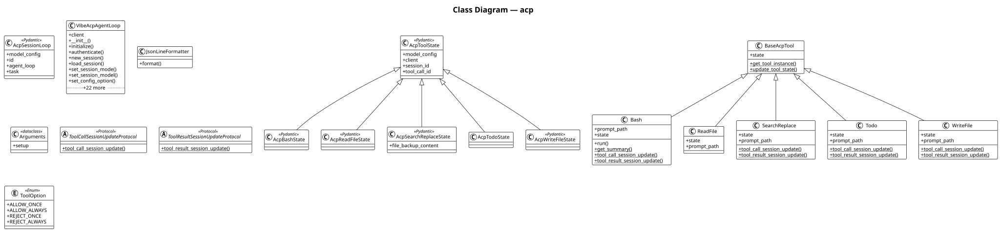

# acp

The **acp** subsystem agent client protocol — session management, acp tools, and server integration. It contains 13 modules with 19 classes, 22 functions, and approximately 1,993 lines of code.

## Class Diagram

## Key Components

The [**VibeAcpAgentLoop**](https://github.com/ibrahimgb/mistral-vibe/blob/87fd92fb12b535b705a6f815cddb938721e9215d/vibe/acp/acp_agent_loop.py#L120) class (extending `AcpAgent`). It exposes `__init__()`, `initialize()`, `authenticate()`, `new_session()`, `load_session()` among 16 public methods. Internally it relies on `_create_approval_callback()`, `_replay_conversation_history()`, `_handle_proxy_setup_command()`.

The [**Bash**](https://github.com/ibrahimgb/mistral-vibe/blob/87fd92fb12b535b705a6f815cddb938721e9215d/vibe/acp/tools/builtins/bash.py#L26) class (extending `CoreBashTool`, `BaseAcpTool[AcpBashState]`). It exposes `run()`, `get_summary()`, `tool_call_session_update()`, `tool_result_session_update()`.

The [**SearchReplace**](https://github.com/ibrahimgb/mistral-vibe/blob/87fd92fb12b535b705a6f815cddb938721e9215d/vibe/acp/tools/builtins/search_replace.py#L28) class (extending `CoreSearchReplaceTool`, `BaseAcpTool[AcpSearchReplaceState]`). It exposes `tool_call_session_update()`, `tool_result_session_update()`.

The [**BaseAcpTool**](https://github.com/ibrahimgb/mistral-vibe/blob/87fd92fb12b535b705a6f815cddb938721e9215d/vibe/acp/tools/base.py#L43) class (extending `BaseTool`). It exposes `get_tool_instance()`, `update_tool_state()`.

The [**WriteFile**](https://github.com/ibrahimgb/mistral-vibe/blob/87fd92fb12b535b705a6f815cddb938721e9215d/vibe/acp/tools/builtins/write_file.py#L28) class (extending `CoreWriteFileTool`, `BaseAcpTool[AcpWriteFileState]`). It exposes `tool_call_session_update()`, `tool_result_session_update()`.

The [**Todo**](https://github.com/ibrahimgb/mistral-vibe/blob/87fd92fb12b535b705a6f815cddb938721e9215d/vibe/acp/tools/builtins/todo.py#L27) class (extending `CoreTodoTool`, `BaseAcpTool[AcpTodoState]`). It exposes `tool_call_session_update()`, `tool_result_session_update()`.

The [**ReadFile**](https://github.com/ibrahimgb/mistral-vibe/blob/87fd92fb12b535b705a6f815cddb938721e9215d/vibe/acp/tools/builtins/read_file.py#L22) class (extending `CoreReadFileTool`, `BaseAcpTool[AcpReadFileState]`). Internally it relies on `_read_file()`.

The [**JsonLineFormatter**](https://github.com/ibrahimgb/mistral-vibe/blob/87fd92fb12b535b705a6f815cddb938721e9215d/vibe/acp/acp_logger.py#L33) class (extending `logging.Formatter`). It exposes `format()`.

The [**ToolCallSessionUpdateProtocol**](https://github.com/ibrahimgb/mistral-vibe/blob/87fd92fb12b535b705a6f815cddb938721e9215d/vibe/acp/tools/base.py#L18) protocol (extending `Protocol`). It exposes `tool_call_session_update()`.

The [**ToolResultSessionUpdateProtocol**](https://github.com/ibrahimgb/mistral-vibe/blob/87fd92fb12b535b705a6f815cddb938721e9215d/vibe/acp/tools/base.py#L24) protocol (extending `Protocol`). It exposes `tool_result_session_update()`.

## Design Patterns

**Factory — create_compact_start_session_update()** — `create_compact_start_session_update()` in `vibe.acp.utils` creates `ToolCallStart`. See [**utils.py**](https://github.com/ibrahimgb/mistral-vibe/blob/87fd92fb12b535b705a6f815cddb938721e9215d/vibe/acp/utils.py).

**Factory — create_compact_end_session_update()** — `create_compact_end_session_update()` in `vibe.acp.utils` creates `ToolCallProgress`. See [**utils.py**](https://github.com/ibrahimgb/mistral-vibe/blob/87fd92fb12b535b705a6f815cddb938721e9215d/vibe/acp/utils.py).

**Factory — create_user_message_replay()** — `create_user_message_replay()` in `vibe.acp.utils` creates `UserMessageChunk`. See [**utils.py**](https://github.com/ibrahimgb/mistral-vibe/blob/87fd92fb12b535b705a6f815cddb938721e9215d/vibe/acp/utils.py).

**Factory — create_assistant_message_replay()** — `create_assistant_message_replay()` in `vibe.acp.utils` creates `AgentMessageChunk | None`. See [**utils.py**](https://github.com/ibrahimgb/mistral-vibe/blob/87fd92fb12b535b705a6f815cddb938721e9215d/vibe/acp/utils.py).

**Factory — create_reasoning_replay()** — `create_reasoning_replay()` in `vibe.acp.utils` creates `AgentThoughtChunk | None`. See [**utils.py**](https://github.com/ibrahimgb/mistral-vibe/blob/87fd92fb12b535b705a6f815cddb938721e9215d/vibe/acp/utils.py).

**Factory — create_tool_call_replay()** — `create_tool_call_replay()` in `vibe.acp.utils` creates `ToolCallStart`. See [**utils.py**](https://github.com/ibrahimgb/mistral-vibe/blob/87fd92fb12b535b705a6f815cddb938721e9215d/vibe/acp/utils.py).

**Factory — create_tool_result_replay()** — `create_tool_result_replay()` in `vibe.acp.utils` creates `ToolCallProgress | None`. See [**utils.py**](https://github.com/ibrahimgb/mistral-vibe/blob/87fd92fb12b535b705a6f815cddb938721e9215d/vibe/acp/utils.py).

**Async Streaming — VibeAcpAgentLoop** — `VibeAcpAgentLoop` uses AsyncGenerator streaming in 1 method(s): `_run_agent_loop`. See [**acp_agent_loop.py**](https://github.com/ibrahimgb/mistral-vibe/blob/87fd92fb12b535b705a6f815cddb938721e9215d/vibe/acp/acp_agent_loop.py).

**Async Streaming — Bash** — `Bash` uses AsyncGenerator streaming in 1 method(s): `run`. See [**bash.py**](https://github.com/ibrahimgb/mistral-vibe/blob/87fd92fb12b535b705a6f815cddb938721e9215d/vibe/acp/tools/builtins/bash.py).

## Modules

- [**vibe/acp/__init__.py**](https://github.com/ibrahimgb/mistral-vibe/blob/87fd92fb12b535b705a6f815cddb938721e9215d/vibe/acp/__init__.py)
- [**vibe/acp/acp_agent_loop.py**](https://github.com/ibrahimgb/mistral-vibe/blob/87fd92fb12b535b705a6f815cddb938721e9215d/vibe/acp/acp_agent_loop.py)
- [**vibe/acp/acp_logger.py**](https://github.com/ibrahimgb/mistral-vibe/blob/87fd92fb12b535b705a6f815cddb938721e9215d/vibe/acp/acp_logger.py)
- [**vibe/acp/entrypoint.py**](https://github.com/ibrahimgb/mistral-vibe/blob/87fd92fb12b535b705a6f815cddb938721e9215d/vibe/acp/entrypoint.py)
- [**vibe/acp/tools/__init__.py**](https://github.com/ibrahimgb/mistral-vibe/blob/87fd92fb12b535b705a6f815cddb938721e9215d/vibe/acp/tools/__init__.py)
- [**vibe/acp/tools/base.py**](https://github.com/ibrahimgb/mistral-vibe/blob/87fd92fb12b535b705a6f815cddb938721e9215d/vibe/acp/tools/base.py)
- [**vibe/acp/tools/builtins/bash.py**](https://github.com/ibrahimgb/mistral-vibe/blob/87fd92fb12b535b705a6f815cddb938721e9215d/vibe/acp/tools/builtins/bash.py)
- [**vibe/acp/tools/builtins/read_file.py**](https://github.com/ibrahimgb/mistral-vibe/blob/87fd92fb12b535b705a6f815cddb938721e9215d/vibe/acp/tools/builtins/read_file.py)
- [**vibe/acp/tools/builtins/search_replace.py**](https://github.com/ibrahimgb/mistral-vibe/blob/87fd92fb12b535b705a6f815cddb938721e9215d/vibe/acp/tools/builtins/search_replace.py)
- [**vibe/acp/tools/builtins/todo.py**](https://github.com/ibrahimgb/mistral-vibe/blob/87fd92fb12b535b705a6f815cddb938721e9215d/vibe/acp/tools/builtins/todo.py)
- [**vibe/acp/tools/builtins/write_file.py**](https://github.com/ibrahimgb/mistral-vibe/blob/87fd92fb12b535b705a6f815cddb938721e9215d/vibe/acp/tools/builtins/write_file.py)
- [**vibe/acp/tools/session_update.py**](https://github.com/ibrahimgb/mistral-vibe/blob/87fd92fb12b535b705a6f815cddb938721e9215d/vibe/acp/tools/session_update.py)
- [**vibe/acp/utils.py**](https://github.com/ibrahimgb/mistral-vibe/blob/87fd92fb12b535b705a6f815cddb938721e9215d/vibe/acp/utils.py)
