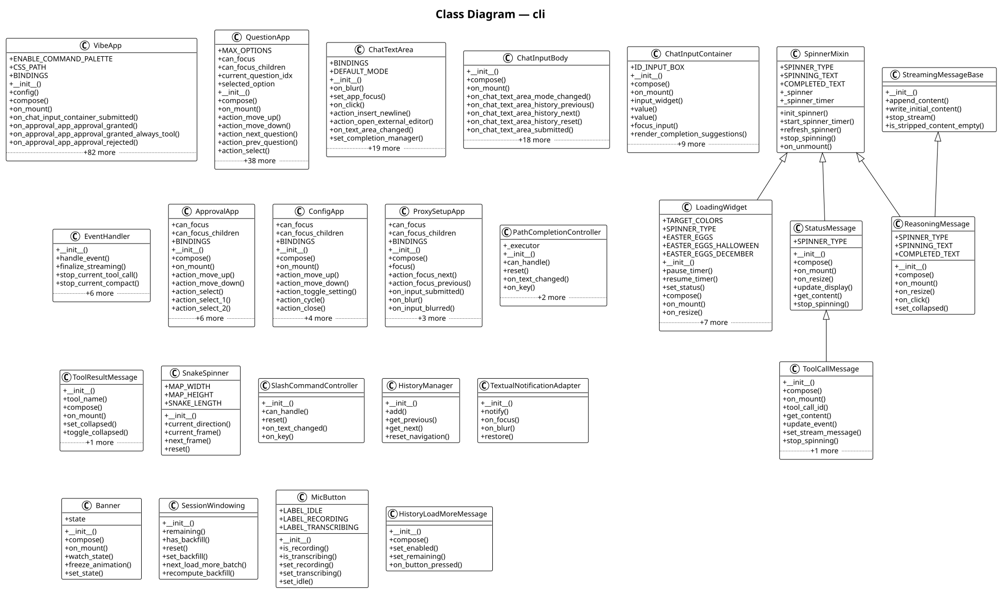

# cli

The **cli** subsystem command-line interface, tui, autocompletion, and user-facing commands. It contains 66 modules with 106 classes, 85 functions, and approximately 8,764 lines of code.

## Class Diagram

## Key Components

The [**VibeApp**](https://github.com/ibrahimgb/mistral-vibe/blob/87fd92fb12b535b705a6f815cddb938721e9215d/vibe/cli/textual_ui/app.py#L195) class (extending `App`). It exposes `__init__()`, `compose()`, `on_mount()`, `on_chat_input_container_submitted()`, `on_approval_app_approval_granted()` among 28 public methods. Internally it relies on `_handle_skill()`, `_handle_bash_command()`, `_resume_history_from_messages()`.

The [**QuestionApp**](https://github.com/ibrahimgb/mistral-vibe/blob/87fd92fb12b535b705a6f815cddb938721e9215d/vibe/cli/textual_ui/widgets/question_app.py#L26) class (extending `Container`). It exposes `__init__()`, `compose()`, `on_mount()`, `action_move_up()`, `action_move_down()` among 14 public methods. Internally it relies on `_format_option_prefix()`, `_update_other_row()`, `_update_submit()`.

The [**ChatTextArea**](https://github.com/ibrahimgb/mistral-vibe/blob/87fd92fb12b535b705a6f815cddb938721e9215d/vibe/cli/textual_ui/widgets/chat_input/text_area.py#L19) class (extending `TextArea`). It exposes `__init__()`, `on_blur()`, `set_app_focus()`, `on_click()`, `action_insert_newline()` among 15 public methods. Internally it relies on `_handle_history_down()`, `_on_key()`.

The [**ChatInputBody**](https://github.com/ibrahimgb/mistral-vibe/blob/87fd92fb12b535b705a6f815cddb938721e9215d/vibe/cli/textual_ui/widgets/chat_input/body.py#L49) class (extending `Widget`). It exposes `__init__()`, `compose()`, `on_mount()`, `on_chat_text_area_mode_changed()`, `on_chat_text_area_history_previous()` among 15 public methods. Internally it relies on `_toggle_recording()`, `_start_recording()`, `_remove_waveform()`.

The [**ChatInputContainer**](https://github.com/ibrahimgb/mistral-vibe/blob/87fd92fb12b535b705a6f815cddb938721e9215d/vibe/cli/textual_ui/widgets/chat_input/container.py#L30) class (extending `Vertical`). It exposes `__init__()`, `compose()`, `on_mount()`, `value()`, `focus_input()` among 12 public methods. Internally it relies on `_format_insertion()`.

The [**LoadingWidget**](https://github.com/ibrahimgb/mistral-vibe/blob/87fd92fb12b535b705a6f815cddb938721e9215d/vibe/cli/textual_ui/widgets/loading.py#L30) class (extending `SpinnerMixin`, `Static`). It exposes `__init__()`, `pause_timer()`, `resume_timer()`, `set_status()`, `compose()` among 7 public methods. Internally it relies on `_update_animation()`.

The [**EventHandler**](https://github.com/ibrahimgb/mistral-vibe/blob/87fd92fb12b535b705a6f815cddb938721e9215d/vibe/cli/textual_ui/handlers/event_handler.py#L28) class. It exposes `__init__()`, `handle_event()`, `finalize_streaming()`, `stop_current_tool_call()`, `stop_current_compact()`.

The [**ApprovalApp**](https://github.com/ibrahimgb/mistral-vibe/blob/87fd92fb12b535b705a6f815cddb938721e9215d/vibe/cli/textual_ui/widgets/approval_app.py#L18) class (extending `Container`). It exposes `__init__()`, `compose()`, `on_mount()`, `action_move_up()`, `action_move_down()` among 11 public methods. Internally it relies on `_update_options()`, `_handle_selection()`.

The [**ConfigApp**](https://github.com/ibrahimgb/mistral-vibe/blob/87fd92fb12b535b705a6f815cddb938721e9215d/vibe/cli/textual_ui/widgets/config_app.py#L25) class (extending `Container`). It exposes `__init__()`, `compose()`, `on_mount()`, `action_move_up()`, `action_move_down()` among 9 public methods. Internally it relies on `_update_display()`.

The [**ProxySetupApp**](https://github.com/ibrahimgb/mistral-vibe/blob/87fd92fb12b535b705a6f815cddb938721e9215d/vibe/cli/textual_ui/widgets/proxy_setup_app.py#L21) class (extending `Container`). It exposes `__init__()`, `compose()`, `focus()`, `action_focus_next()`, `action_focus_previous()` among 9 public methods.

## Design Patterns

**Protocol / Adapter — UpdateCacheRepository** — `UpdateCacheRepository` defines a port with 1 adapter(s): `FileSystemUpdateCacheRepository`. See [**update_cache_repository.py**](https://github.com/ibrahimgb/mistral-vibe/blob/87fd92fb12b535b705a6f815cddb938721e9215d/vibe/cli/update_notifier/ports/update_cache_repository.py), [**filesystem_update_cache_repository.py**](https://github.com/ibrahimgb/mistral-vibe/blob/87fd92fb12b535b705a6f815cddb938721e9215d/vibe/cli/update_notifier/adapters/filesystem_update_cache_repository.py).

**Protocol / Adapter — UpdateGateway** — `UpdateGateway` defines a port with 2 adapter(s): `GitHubUpdateGateway`, `PyPIUpdateGateway`. See [**update_gateway.py**](https://github.com/ibrahimgb/mistral-vibe/blob/87fd92fb12b535b705a6f815cddb938721e9215d/vibe/cli/update_notifier/ports/update_gateway.py), [**github_update_gateway.py**](https://github.com/ibrahimgb/mistral-vibe/blob/87fd92fb12b535b705a6f815cddb938721e9215d/vibe/cli/update_notifier/adapters/github_update_gateway.py), [**pypi_update_gateway.py**](https://github.com/ibrahimgb/mistral-vibe/blob/87fd92fb12b535b705a6f815cddb938721e9215d/vibe/cli/update_notifier/adapters/pypi_update_gateway.py).

**Factory — create_spinner()** — `create_spinner()` in `vibe.cli.textual_ui.widgets.spinner` creates `Spinner`. See [**spinner.py**](https://github.com/ibrahimgb/mistral-vibe/blob/87fd92fb12b535b705a6f815cddb938721e9215d/vibe/cli/textual_ui/widgets/spinner.py).

**Factory — create_resume_plan()** — `create_resume_plan()` in `vibe.cli.textual_ui.windowing.history_windowing` creates `HistoryResumePlan | None`. See [**history_windowing.py**](https://github.com/ibrahimgb/mistral-vibe/blob/87fd92fb12b535b705a6f815cddb938721e9215d/vibe/cli/textual_ui/windowing/history_windowing.py).

**Auto-Discovery — HistoryManager** — `HistoryManager` auto-discovers plugins via `_load_history()`. See [**history_manager.py**](https://github.com/ibrahimgb/mistral-vibe/blob/87fd92fb12b535b705a6f815cddb938721e9215d/vibe/cli/history_manager.py).

## Modules

- [**vibe/cli/__init__.py**](https://github.com/ibrahimgb/mistral-vibe/blob/87fd92fb12b535b705a6f815cddb938721e9215d/vibe/cli/__init__.py)
- [**vibe/cli/autocompletion/__init__.py**](https://github.com/ibrahimgb/mistral-vibe/blob/87fd92fb12b535b705a6f815cddb938721e9215d/vibe/cli/autocompletion/__init__.py)
- [**vibe/cli/autocompletion/base.py**](https://github.com/ibrahimgb/mistral-vibe/blob/87fd92fb12b535b705a6f815cddb938721e9215d/vibe/cli/autocompletion/base.py)
- [**vibe/cli/autocompletion/path_completion.py**](https://github.com/ibrahimgb/mistral-vibe/blob/87fd92fb12b535b705a6f815cddb938721e9215d/vibe/cli/autocompletion/path_completion.py)
- [**vibe/cli/autocompletion/slash_command.py**](https://github.com/ibrahimgb/mistral-vibe/blob/87fd92fb12b535b705a6f815cddb938721e9215d/vibe/cli/autocompletion/slash_command.py)
- [**vibe/cli/cli.py**](https://github.com/ibrahimgb/mistral-vibe/blob/87fd92fb12b535b705a6f815cddb938721e9215d/vibe/cli/cli.py)
- [**vibe/cli/clipboard.py**](https://github.com/ibrahimgb/mistral-vibe/blob/87fd92fb12b535b705a6f815cddb938721e9215d/vibe/cli/clipboard.py)
- [**vibe/cli/commands.py**](https://github.com/ibrahimgb/mistral-vibe/blob/87fd92fb12b535b705a6f815cddb938721e9215d/vibe/cli/commands.py)
- [**vibe/cli/entrypoint.py**](https://github.com/ibrahimgb/mistral-vibe/blob/87fd92fb12b535b705a6f815cddb938721e9215d/vibe/cli/entrypoint.py)
- [**vibe/cli/history_manager.py**](https://github.com/ibrahimgb/mistral-vibe/blob/87fd92fb12b535b705a6f815cddb938721e9215d/vibe/cli/history_manager.py)
- [**vibe/cli/plan_offer/adapters/http_whoami_gateway.py**](https://github.com/ibrahimgb/mistral-vibe/blob/87fd92fb12b535b705a6f815cddb938721e9215d/vibe/cli/plan_offer/adapters/http_whoami_gateway.py)
- [**vibe/cli/plan_offer/decide_plan_offer.py**](https://github.com/ibrahimgb/mistral-vibe/blob/87fd92fb12b535b705a6f815cddb938721e9215d/vibe/cli/plan_offer/decide_plan_offer.py)
- [**vibe/cli/plan_offer/ports/whoami_gateway.py**](https://github.com/ibrahimgb/mistral-vibe/blob/87fd92fb12b535b705a6f815cddb938721e9215d/vibe/cli/plan_offer/ports/whoami_gateway.py)
- [**vibe/cli/terminal_setup.py**](https://github.com/ibrahimgb/mistral-vibe/blob/87fd92fb12b535b705a6f815cddb938721e9215d/vibe/cli/terminal_setup.py)
- [**vibe/cli/textual_ui/__init__.py**](https://github.com/ibrahimgb/mistral-vibe/blob/87fd92fb12b535b705a6f815cddb938721e9215d/vibe/cli/textual_ui/__init__.py)
- [**vibe/cli/textual_ui/ansi_markdown.py**](https://github.com/ibrahimgb/mistral-vibe/blob/87fd92fb12b535b705a6f815cddb938721e9215d/vibe/cli/textual_ui/ansi_markdown.py)
- [**vibe/cli/textual_ui/app.py**](https://github.com/ibrahimgb/mistral-vibe/blob/87fd92fb12b535b705a6f815cddb938721e9215d/vibe/cli/textual_ui/app.py)
- [**vibe/cli/textual_ui/external_editor.py**](https://github.com/ibrahimgb/mistral-vibe/blob/87fd92fb12b535b705a6f815cddb938721e9215d/vibe/cli/textual_ui/external_editor.py)
- [**vibe/cli/textual_ui/handlers/__init__.py**](https://github.com/ibrahimgb/mistral-vibe/blob/87fd92fb12b535b705a6f815cddb938721e9215d/vibe/cli/textual_ui/handlers/__init__.py)
- [**vibe/cli/textual_ui/handlers/event_handler.py**](https://github.com/ibrahimgb/mistral-vibe/blob/87fd92fb12b535b705a6f815cddb938721e9215d/vibe/cli/textual_ui/handlers/event_handler.py)
- [**vibe/cli/textual_ui/notifications/__init__.py**](https://github.com/ibrahimgb/mistral-vibe/blob/87fd92fb12b535b705a6f815cddb938721e9215d/vibe/cli/textual_ui/notifications/__init__.py)
- [**vibe/cli/textual_ui/notifications/adapters/__init__.py**](https://github.com/ibrahimgb/mistral-vibe/blob/87fd92fb12b535b705a6f815cddb938721e9215d/vibe/cli/textual_ui/notifications/adapters/__init__.py)
- [**vibe/cli/textual_ui/notifications/adapters/textual_notification_adapter.py**](https://github.com/ibrahimgb/mistral-vibe/blob/87fd92fb12b535b705a6f815cddb938721e9215d/vibe/cli/textual_ui/notifications/adapters/textual_notification_adapter.py)
- [**vibe/cli/textual_ui/notifications/ports/__init__.py**](https://github.com/ibrahimgb/mistral-vibe/blob/87fd92fb12b535b705a6f815cddb938721e9215d/vibe/cli/textual_ui/notifications/ports/__init__.py)
- [**vibe/cli/textual_ui/notifications/ports/notification_port.py**](https://github.com/ibrahimgb/mistral-vibe/blob/87fd92fb12b535b705a6f815cddb938721e9215d/vibe/cli/textual_ui/notifications/ports/notification_port.py)
- [**vibe/cli/textual_ui/widgets/__init__.py**](https://github.com/ibrahimgb/mistral-vibe/blob/87fd92fb12b535b705a6f815cddb938721e9215d/vibe/cli/textual_ui/widgets/__init__.py)
- [**vibe/cli/textual_ui/widgets/approval_app.py**](https://github.com/ibrahimgb/mistral-vibe/blob/87fd92fb12b535b705a6f815cddb938721e9215d/vibe/cli/textual_ui/widgets/approval_app.py)
- [**vibe/cli/textual_ui/widgets/banner/banner.py**](https://github.com/ibrahimgb/mistral-vibe/blob/87fd92fb12b535b705a6f815cddb938721e9215d/vibe/cli/textual_ui/widgets/banner/banner.py)
- [**vibe/cli/textual_ui/widgets/banner/petit_chat.py**](https://github.com/ibrahimgb/mistral-vibe/blob/87fd92fb12b535b705a6f815cddb938721e9215d/vibe/cli/textual_ui/widgets/banner/petit_chat.py)
- [**vibe/cli/textual_ui/widgets/braille_renderer.py**](https://github.com/ibrahimgb/mistral-vibe/blob/87fd92fb12b535b705a6f815cddb938721e9215d/vibe/cli/textual_ui/widgets/braille_renderer.py)
- [**vibe/cli/textual_ui/widgets/chat_input/__init__.py**](https://github.com/ibrahimgb/mistral-vibe/blob/87fd92fb12b535b705a6f815cddb938721e9215d/vibe/cli/textual_ui/widgets/chat_input/__init__.py)
- [**vibe/cli/textual_ui/widgets/chat_input/body.py**](https://github.com/ibrahimgb/mistral-vibe/blob/87fd92fb12b535b705a6f815cddb938721e9215d/vibe/cli/textual_ui/widgets/chat_input/body.py)
- [**vibe/cli/textual_ui/widgets/chat_input/completion_manager.py**](https://github.com/ibrahimgb/mistral-vibe/blob/87fd92fb12b535b705a6f815cddb938721e9215d/vibe/cli/textual_ui/widgets/chat_input/completion_manager.py)
- [**vibe/cli/textual_ui/widgets/chat_input/completion_popup.py**](https://github.com/ibrahimgb/mistral-vibe/blob/87fd92fb12b535b705a6f815cddb938721e9215d/vibe/cli/textual_ui/widgets/chat_input/completion_popup.py)
- [**vibe/cli/textual_ui/widgets/chat_input/container.py**](https://github.com/ibrahimgb/mistral-vibe/blob/87fd92fb12b535b705a6f815cddb938721e9215d/vibe/cli/textual_ui/widgets/chat_input/container.py)
- [**vibe/cli/textual_ui/widgets/chat_input/mic_button.py**](https://github.com/ibrahimgb/mistral-vibe/blob/87fd92fb12b535b705a6f815cddb938721e9215d/vibe/cli/textual_ui/widgets/chat_input/mic_button.py) — Microphone toggle button for the chat input bar.
- [**vibe/cli/textual_ui/widgets/chat_input/text_area.py**](https://github.com/ibrahimgb/mistral-vibe/blob/87fd92fb12b535b705a6f815cddb938721e9215d/vibe/cli/textual_ui/widgets/chat_input/text_area.py)
- [**vibe/cli/textual_ui/widgets/chat_input/waveform.py**](https://github.com/ibrahimgb/mistral-vibe/blob/87fd92fb12b535b705a6f815cddb938721e9215d/vibe/cli/textual_ui/widgets/chat_input/waveform.py) — Real-time centre-driven waveform visualizer for the recording state.
- [**vibe/cli/textual_ui/widgets/compact.py**](https://github.com/ibrahimgb/mistral-vibe/blob/87fd92fb12b535b705a6f815cddb938721e9215d/vibe/cli/textual_ui/widgets/compact.py)
- [**vibe/cli/textual_ui/widgets/config_app.py**](https://github.com/ibrahimgb/mistral-vibe/blob/87fd92fb12b535b705a6f815cddb938721e9215d/vibe/cli/textual_ui/widgets/config_app.py)
- [**vibe/cli/textual_ui/widgets/context_progress.py**](https://github.com/ibrahimgb/mistral-vibe/blob/87fd92fb12b535b705a6f815cddb938721e9215d/vibe/cli/textual_ui/widgets/context_progress.py)
- [**vibe/cli/textual_ui/widgets/load_more.py**](https://github.com/ibrahimgb/mistral-vibe/blob/87fd92fb12b535b705a6f815cddb938721e9215d/vibe/cli/textual_ui/widgets/load_more.py)
- [**vibe/cli/textual_ui/widgets/loading.py**](https://github.com/ibrahimgb/mistral-vibe/blob/87fd92fb12b535b705a6f815cddb938721e9215d/vibe/cli/textual_ui/widgets/loading.py)
- [**vibe/cli/textual_ui/widgets/messages.py**](https://github.com/ibrahimgb/mistral-vibe/blob/87fd92fb12b535b705a6f815cddb938721e9215d/vibe/cli/textual_ui/widgets/messages.py)
- [**vibe/cli/textual_ui/widgets/no_markup_static.py**](https://github.com/ibrahimgb/mistral-vibe/blob/87fd92fb12b535b705a6f815cddb938721e9215d/vibe/cli/textual_ui/widgets/no_markup_static.py)
- [**vibe/cli/textual_ui/widgets/path_display.py**](https://github.com/ibrahimgb/mistral-vibe/blob/87fd92fb12b535b705a6f815cddb938721e9215d/vibe/cli/textual_ui/widgets/path_display.py)
- [**vibe/cli/textual_ui/widgets/proxy_setup_app.py**](https://github.com/ibrahimgb/mistral-vibe/blob/87fd92fb12b535b705a6f815cddb938721e9215d/vibe/cli/textual_ui/widgets/proxy_setup_app.py)
- [**vibe/cli/textual_ui/widgets/question_app.py**](https://github.com/ibrahimgb/mistral-vibe/blob/87fd92fb12b535b705a6f815cddb938721e9215d/vibe/cli/textual_ui/widgets/question_app.py)
- [**vibe/cli/textual_ui/widgets/session_picker.py**](https://github.com/ibrahimgb/mistral-vibe/blob/87fd92fb12b535b705a6f815cddb938721e9215d/vibe/cli/textual_ui/widgets/session_picker.py)
- [**vibe/cli/textual_ui/widgets/spinner.py**](https://github.com/ibrahimgb/mistral-vibe/blob/87fd92fb12b535b705a6f815cddb938721e9215d/vibe/cli/textual_ui/widgets/spinner.py)
- [**vibe/cli/textual_ui/widgets/status_message.py**](https://github.com/ibrahimgb/mistral-vibe/blob/87fd92fb12b535b705a6f815cddb938721e9215d/vibe/cli/textual_ui/widgets/status_message.py)
- [**vibe/cli/textual_ui/widgets/teleport_message.py**](https://github.com/ibrahimgb/mistral-vibe/blob/87fd92fb12b535b705a6f815cddb938721e9215d/vibe/cli/textual_ui/widgets/teleport_message.py)
- [**vibe/cli/textual_ui/widgets/tool_widgets.py**](https://github.com/ibrahimgb/mistral-vibe/blob/87fd92fb12b535b705a6f815cddb938721e9215d/vibe/cli/textual_ui/widgets/tool_widgets.py)
- [**vibe/cli/textual_ui/widgets/tools.py**](https://github.com/ibrahimgb/mistral-vibe/blob/87fd92fb12b535b705a6f815cddb938721e9215d/vibe/cli/textual_ui/widgets/tools.py)
- [**vibe/cli/textual_ui/windowing/__init__.py**](https://github.com/ibrahimgb/mistral-vibe/blob/87fd92fb12b535b705a6f815cddb938721e9215d/vibe/cli/textual_ui/windowing/__init__.py)
- [**vibe/cli/textual_ui/windowing/history.py**](https://github.com/ibrahimgb/mistral-vibe/blob/87fd92fb12b535b705a6f815cddb938721e9215d/vibe/cli/textual_ui/windowing/history.py)
- [**vibe/cli/textual_ui/windowing/history_windowing.py**](https://github.com/ibrahimgb/mistral-vibe/blob/87fd92fb12b535b705a6f815cddb938721e9215d/vibe/cli/textual_ui/windowing/history_windowing.py)
- [**vibe/cli/textual_ui/windowing/state.py**](https://github.com/ibrahimgb/mistral-vibe/blob/87fd92fb12b535b705a6f815cddb938721e9215d/vibe/cli/textual_ui/windowing/state.py)
- [**vibe/cli/update_notifier/__init__.py**](https://github.com/ibrahimgb/mistral-vibe/blob/87fd92fb12b535b705a6f815cddb938721e9215d/vibe/cli/update_notifier/__init__.py)
- [**vibe/cli/update_notifier/adapters/filesystem_update_cache_repository.py**](https://github.com/ibrahimgb/mistral-vibe/blob/87fd92fb12b535b705a6f815cddb938721e9215d/vibe/cli/update_notifier/adapters/filesystem_update_cache_repository.py)
- [**vibe/cli/update_notifier/adapters/github_update_gateway.py**](https://github.com/ibrahimgb/mistral-vibe/blob/87fd92fb12b535b705a6f815cddb938721e9215d/vibe/cli/update_notifier/adapters/github_update_gateway.py)
- [**vibe/cli/update_notifier/adapters/pypi_update_gateway.py**](https://github.com/ibrahimgb/mistral-vibe/blob/87fd92fb12b535b705a6f815cddb938721e9215d/vibe/cli/update_notifier/adapters/pypi_update_gateway.py)
- [**vibe/cli/update_notifier/ports/update_cache_repository.py**](https://github.com/ibrahimgb/mistral-vibe/blob/87fd92fb12b535b705a6f815cddb938721e9215d/vibe/cli/update_notifier/ports/update_cache_repository.py)
- [**vibe/cli/update_notifier/ports/update_gateway.py**](https://github.com/ibrahimgb/mistral-vibe/blob/87fd92fb12b535b705a6f815cddb938721e9215d/vibe/cli/update_notifier/ports/update_gateway.py)
- [**vibe/cli/update_notifier/update.py**](https://github.com/ibrahimgb/mistral-vibe/blob/87fd92fb12b535b705a6f815cddb938721e9215d/vibe/cli/update_notifier/update.py)
- [**vibe/cli/update_notifier/whats_new.py**](https://github.com/ibrahimgb/mistral-vibe/blob/87fd92fb12b535b705a6f815cddb938721e9215d/vibe/cli/update_notifier/whats_new.py)
