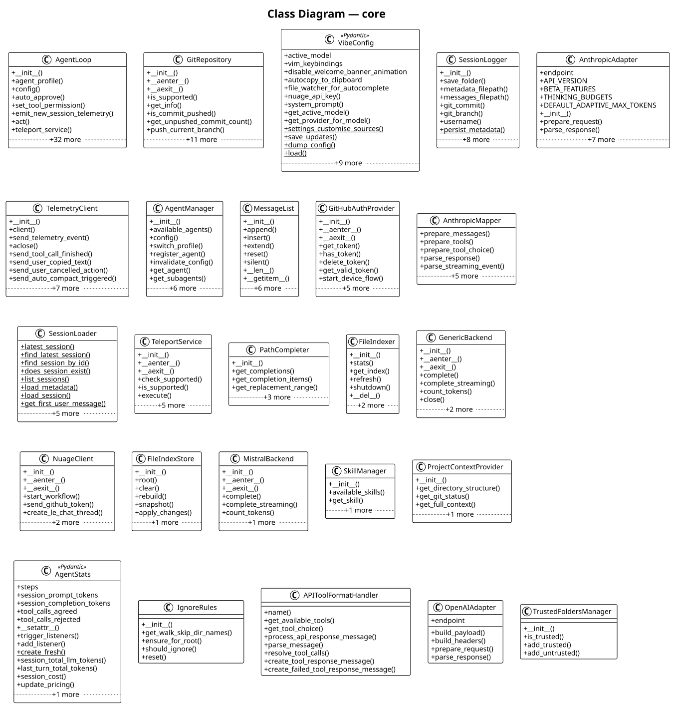

# core

The **core** subsystem core agent loop, configuration, llm backends, middleware, and orchestration. It contains 58 modules with 158 classes, 72 functions, and approximately 9,690 lines of code.

## Class Diagram

## Key Components

The [**AgentLoop**](https://github.com/ibrahimgb/mistral-vibe/blob/87fd92fb12b535b705a6f815cddb938721e9215d/vibe/core/agent_loop.py#L142) class. It exposes `__init__()`, `set_tool_permission()`, `emit_new_session_telemetry()`, `act()`, `teleport_to_vibe_nuage()` among 11 public methods. Internally it relies on `_setup_middleware()`, `_handle_middleware_result()`, `_conversation_loop()`.

The [**GitRepository**](https://github.com/ibrahimgb/mistral-vibe/blob/87fd92fb12b535b705a6f815cddb938721e9215d/vibe/core/teleport/git.py#L27) class. It exposes `__init__()`, `__aenter__()`, `__aexit__()`, `is_supported()`, `get_info()` among 8 public methods.

The [**VibeConfig**](https://github.com/ibrahimgb/mistral-vibe/blob/87fd92fb12b535b705a6f815cddb938721e9215d/vibe/core/config.py#L313) Pydantic model (extending `BaseSettings`). Key fields include `active_model`, `vim_keybindings`, `disable_welcome_banner_animation`, `autocopy_to_clipboard`, `file_watcher_for_autocomplete`, `displayed_workdir`, `auto_compact_threshold`, `context_warnings`, …. It exposes `get_active_model()`, `get_provider_for_model()`, `settings_customise_sources()`, `save_updates()`, `dump_config()` among 7 public methods.

The [**SessionLogger**](https://github.com/ibrahimgb/mistral-vibe/blob/87fd92fb12b535b705a6f815cddb938721e9215d/vibe/core/session/session_logger.py#L32) class. It exposes `__init__()`, `persist_metadata()`, `persist_messages()`, `save_interaction()`, `reset_session()` among 8 public methods.

The [**AnthropicAdapter**](https://github.com/ibrahimgb/mistral-vibe/blob/87fd92fb12b535b705a6f815cddb938721e9215d/vibe/core/llm/backend/anthropic.py#L318) class (extending `APIAdapter`). It exposes `__init__()`, `prepare_request()`, `parse_response()`. Internally it relies on `_apply_thinking_config()`, `_build_payload()`, `_parse_streaming_event()`.

The [**TelemetryClient**](https://github.com/ibrahimgb/mistral-vibe/blob/87fd92fb12b535b705a6f815cddb938721e9215d/vibe/core/telemetry/send.py#L21) class. It exposes `__init__()`, `send_telemetry_event()`, `aclose()`, `send_tool_call_finished()`, `send_user_copied_text()` among 10 public methods. Internally it relies on `_get_mistral_api_key()`, `_is_enabled()`.

The [**AgentManager**](https://github.com/ibrahimgb/mistral-vibe/blob/87fd92fb12b535b705a6f815cddb938721e9215d/vibe/core/agents/manager.py#L22) class. It exposes `__init__()`, `switch_profile()`, `register_agent()`, `invalidate_config()`, `get_agent()` among 8 public methods. Internally it relies on `_discover_agents()`.

The [**MessageList**](https://github.com/ibrahimgb/mistral-vibe/blob/87fd92fb12b535b705a6f815cddb938721e9215d/vibe/core/types.py#L419) class (extending `Sequence[LLMMessage]`). It exposes `__init__()`, `append()`, `insert()`, `extend()`, `reset()` among 13 public methods.

The [**GitHubAuthProvider**](https://github.com/ibrahimgb/mistral-vibe/blob/87fd92fb12b535b705a6f815cddb938721e9215d/vibe/core/auth/github.py#L39) class. It exposes `__init__()`, `__aenter__()`, `__aexit__()`, `get_token()`, `has_token()` among 9 public methods. Internally it relies on `_poll_for_token()`.

The [**AnthropicMapper**](https://github.com/ibrahimgb/mistral-vibe/blob/87fd92fb12b535b705a6f815cddb938721e9215d/vibe/core/llm/backend/anthropic.py#L22) class shared mapper for converting messages to/from anthropic api format. It exposes `prepare_messages()`, `prepare_tools()`, `prepare_tool_choice()`, `parse_response()`, `parse_streaming_event()`. Internally it relies on `_handle_block_start()`, `_handle_block_delta()`.

## Design Patterns

**Protocol / Adapter — APIAdapter** — `APIAdapter` defines a port with 2 adapter(s): `AnthropicAdapter`, `OpenAIAdapter`. See [**base.py**](https://github.com/ibrahimgb/mistral-vibe/blob/87fd92fb12b535b705a6f815cddb938721e9215d/vibe/core/llm/backend/base.py), [**anthropic.py**](https://github.com/ibrahimgb/mistral-vibe/blob/87fd92fb12b535b705a6f815cddb938721e9215d/vibe/core/llm/backend/anthropic.py), [**generic.py**](https://github.com/ibrahimgb/mistral-vibe/blob/87fd92fb12b535b705a6f815cddb938721e9215d/vibe/core/llm/backend/generic.py).

**Template Method — OutputFormatter** — `OutputFormatter` defines 3 abstract hook(s) (`on_message_added`, `on_event`, `finalize`) with 1 concrete method(s) providing the template. See [**output_formatters.py**](https://github.com/ibrahimgb/mistral-vibe/blob/87fd92fb12b535b705a6f815cddb938721e9215d/vibe/core/output_formatters.py).

**Template Method — BaseTool** — `BaseTool` defines 1 abstract hook(s) (`run`) with 9 concrete method(s) providing the template. See [**base.py**](https://github.com/ibrahimgb/mistral-vibe/blob/87fd92fb12b535b705a6f815cddb938721e9215d/vibe/core/tools/base.py).

**Template Method — ToolUIData** — `ToolUIData` defines 2 abstract hook(s) (`get_result_display`, `get_status_text`) with 4 concrete method(s) providing the template. See [**ui.py**](https://github.com/ibrahimgb/mistral-vibe/blob/87fd92fb12b535b705a6f815cddb938721e9215d/vibe/core/tools/ui.py).

**Factory — build_path_prompt_payload()** — `build_path_prompt_payload()` in `vibe.core.autocompletion.path_prompt` creates `PathPromptPayload`. See [**path_prompt.py**](https://github.com/ibrahimgb/mistral-vibe/blob/87fd92fb12b535b705a6f815cddb938721e9215d/vibe/core/autocompletion/path_prompt.py).

**Factory — BackendErrorBuilder.build_http_error()** — `BackendErrorBuilder.build_http_error()` creates `BackendError`. See [**exceptions.py**](https://github.com/ibrahimgb/mistral-vibe/blob/87fd92fb12b535b705a6f815cddb938721e9215d/vibe/core/llm/exceptions.py).

**Factory — BackendErrorBuilder.build_request_error()** — `BackendErrorBuilder.build_request_error()` creates `BackendError`. See [**exceptions.py**](https://github.com/ibrahimgb/mistral-vibe/blob/87fd92fb12b535b705a6f815cddb938721e9215d/vibe/core/llm/exceptions.py).

**Factory — create_formatter()** — `create_formatter()` in `vibe.core.output_formatters` creates `OutputFormatter`. See [**output_formatters.py**](https://github.com/ibrahimgb/mistral-vibe/blob/87fd92fb12b535b705a6f815cddb938721e9215d/vibe/core/output_formatters.py).

**Factory — BaseTool.create_config_with_permission()** — `BaseTool.create_config_with_permission()` creates `BaseToolConfig`. See [**base.py**](https://github.com/ibrahimgb/mistral-vibe/blob/87fd92fb12b535b705a6f815cddb938721e9215d/vibe/core/tools/base.py).

**Factory — AgentStats.create_fresh()** — `AgentStats.create_fresh()` creates `AgentStats`. See [**types.py**](https://github.com/ibrahimgb/mistral-vibe/blob/87fd92fb12b535b705a6f815cddb938721e9215d/vibe/core/types.py).

**Factory — build_wiki_site()** — `build_wiki_site()` in `vibe.core.wiki.site_builder` creates `WikiBuildResult`. See [**site_builder.py**](https://github.com/ibrahimgb/mistral-vibe/blob/87fd92fb12b535b705a6f815cddb938721e9215d/vibe/core/wiki/site_builder.py).

**Middleware Pipeline — vibe.core.middleware** — Module `vibe.core.middleware` implements a middleware pipeline. See [**middleware.py**](https://github.com/ibrahimgb/mistral-vibe/blob/87fd92fb12b535b705a6f815cddb938721e9215d/vibe/core/middleware.py).

**Async Streaming — AgentLoop** — `AgentLoop` uses AsyncGenerator streaming in 10 method(s): `act`, `_teleport_generator`, `_handle_middleware_result`, `_conversation_loop`. See [**agent_loop.py**](https://github.com/ibrahimgb/mistral-vibe/blob/87fd92fb12b535b705a6f815cddb938721e9215d/vibe/core/agent_loop.py).

**Async Streaming — GenericBackend** — `GenericBackend` uses AsyncGenerator streaming in 2 method(s): `complete_streaming`, `_make_streaming_request`. See [**generic.py**](https://github.com/ibrahimgb/mistral-vibe/blob/87fd92fb12b535b705a6f815cddb938721e9215d/vibe/core/llm/backend/generic.py).

**Async Streaming — MistralBackend** — `MistralBackend` uses AsyncGenerator streaming in 1 method(s): `complete_streaming`. See [**mistral.py**](https://github.com/ibrahimgb/mistral-vibe/blob/87fd92fb12b535b705a6f815cddb938721e9215d/vibe/core/llm/backend/mistral.py).

**Async Streaming — TeleportService** — `TeleportService` uses AsyncGenerator streaming in 1 method(s): `execute`. See [**teleport.py**](https://github.com/ibrahimgb/mistral-vibe/blob/87fd92fb12b535b705a6f815cddb938721e9215d/vibe/core/teleport/teleport.py).

**Async Streaming — BaseTool** — `BaseTool` uses AsyncGenerator streaming in 2 method(s): `run`, `invoke`. See [**base.py**](https://github.com/ibrahimgb/mistral-vibe/blob/87fd92fb12b535b705a6f815cddb938721e9215d/vibe/core/tools/base.py).

**Async Streaming — AskUserQuestion** — `AskUserQuestion` uses AsyncGenerator streaming in 1 method(s): `run`. See [**ask_user_question.py**](https://github.com/ibrahimgb/mistral-vibe/blob/87fd92fb12b535b705a6f815cddb938721e9215d/vibe/core/tools/builtins/ask_user_question.py).

**Async Streaming — Bash** — `Bash` uses AsyncGenerator streaming in 1 method(s): `run`. See [**bash.py**](https://github.com/ibrahimgb/mistral-vibe/blob/87fd92fb12b535b705a6f815cddb938721e9215d/vibe/core/tools/builtins/bash.py).

**Async Streaming — Grep** — `Grep` uses AsyncGenerator streaming in 1 method(s): `run`. See [**grep.py**](https://github.com/ibrahimgb/mistral-vibe/blob/87fd92fb12b535b705a6f815cddb938721e9215d/vibe/core/tools/builtins/grep.py).

**Async Streaming — ReadFile** — `ReadFile` uses AsyncGenerator streaming in 1 method(s): `run`. See [**read_file.py**](https://github.com/ibrahimgb/mistral-vibe/blob/87fd92fb12b535b705a6f815cddb938721e9215d/vibe/core/tools/builtins/read_file.py).

**Async Streaming — SearchReplace** — `SearchReplace` uses AsyncGenerator streaming in 1 method(s): `run`. See [**search_replace.py**](https://github.com/ibrahimgb/mistral-vibe/blob/87fd92fb12b535b705a6f815cddb938721e9215d/vibe/core/tools/builtins/search_replace.py).

**Async Streaming — Task** — `Task` uses AsyncGenerator streaming in 1 method(s): `run`. See [**task.py**](https://github.com/ibrahimgb/mistral-vibe/blob/87fd92fb12b535b705a6f815cddb938721e9215d/vibe/core/tools/builtins/task.py).

**Async Streaming — Todo** — `Todo` uses AsyncGenerator streaming in 1 method(s): `run`. See [**todo.py**](https://github.com/ibrahimgb/mistral-vibe/blob/87fd92fb12b535b705a6f815cddb938721e9215d/vibe/core/tools/builtins/todo.py).

**Async Streaming — WebFetch** — `WebFetch` uses AsyncGenerator streaming in 1 method(s): `run`. See [**webfetch.py**](https://github.com/ibrahimgb/mistral-vibe/blob/87fd92fb12b535b705a6f815cddb938721e9215d/vibe/core/tools/builtins/webfetch.py).

**Async Streaming — WebSearch** — `WebSearch` uses AsyncGenerator streaming in 1 method(s): `run`. See [**websearch.py**](https://github.com/ibrahimgb/mistral-vibe/blob/87fd92fb12b535b705a6f815cddb938721e9215d/vibe/core/tools/builtins/websearch.py).

**Async Streaming — WikiDiagram** — `WikiDiagram` uses AsyncGenerator streaming in 1 method(s): `run`. See [**wiki_diagram.py**](https://github.com/ibrahimgb/mistral-vibe/blob/87fd92fb12b535b705a6f815cddb938721e9215d/vibe/core/tools/builtins/wiki_diagram.py).

**Async Streaming — WikiDoc** — `WikiDoc` uses AsyncGenerator streaming in 1 method(s): `run`. See [**wiki_doc.py**](https://github.com/ibrahimgb/mistral-vibe/blob/87fd92fb12b535b705a6f815cddb938721e9215d/vibe/core/tools/builtins/wiki_doc.py).

**Async Streaming — WriteFile** — `WriteFile` uses AsyncGenerator streaming in 1 method(s): `run`. See [**write_file.py**](https://github.com/ibrahimgb/mistral-vibe/blob/87fd92fb12b535b705a6f815cddb938721e9215d/vibe/core/tools/builtins/write_file.py).

**Async Streaming — _mcp_stderr_capture()** — `_mcp_stderr_capture()` in `vibe.core.tools.mcp.tools` yields an async stream. See [**tools.py**](https://github.com/ibrahimgb/mistral-vibe/blob/87fd92fb12b535b705a6f815cddb938721e9215d/vibe/core/tools/mcp/tools.py).

**Auto-Discovery — AgentManager** — `AgentManager` auto-discovers plugins via `register_agent()`, `_discover_agents()`, `_try_load_agent()`. See [**manager.py**](https://github.com/ibrahimgb/mistral-vibe/blob/87fd92fb12b535b705a6f815cddb938721e9215d/vibe/core/agents/manager.py).

**Auto-Discovery — SkillManager** — `SkillManager` auto-discovers plugins via `_discover_skills()`, `_discover_skills_in_dir()`, `_try_load_skill()`. See [**manager.py**](https://github.com/ibrahimgb/mistral-vibe/blob/87fd92fb12b535b705a6f815cddb938721e9215d/vibe/core/skills/manager.py).

**Auto-Discovery — ToolManager** — `ToolManager` auto-discovers plugins via `_iter_tool_classes()`, `_load_tools_from_file()`, `discover_tool_defaults()`. See [**manager.py**](https://github.com/ibrahimgb/mistral-vibe/blob/87fd92fb12b535b705a6f815cddb938721e9215d/vibe/core/tools/manager.py).

**Config-as-Code — ProjectContextConfig** — `ProjectContextConfig` in `vibe.core.config` uses Pydantic for typed configuration with 8 field(s). See [**config.py**](https://github.com/ibrahimgb/mistral-vibe/blob/87fd92fb12b535b705a6f815cddb938721e9215d/vibe/core/config.py).

**Config-as-Code — SessionLoggingConfig** — `SessionLoggingConfig` in `vibe.core.config` uses Pydantic for typed configuration with 3 field(s). See [**config.py**](https://github.com/ibrahimgb/mistral-vibe/blob/87fd92fb12b535b705a6f815cddb938721e9215d/vibe/core/config.py).

**Config-as-Code — ProviderConfig** — `ProviderConfig` in `vibe.core.config` uses Pydantic for typed configuration with 8 field(s). See [**config.py**](https://github.com/ibrahimgb/mistral-vibe/blob/87fd92fb12b535b705a6f815cddb938721e9215d/vibe/core/config.py).

**Config-as-Code — ModelConfig** — `ModelConfig` in `vibe.core.config` uses Pydantic for typed configuration with 7 field(s). See [**config.py**](https://github.com/ibrahimgb/mistral-vibe/blob/87fd92fb12b535b705a6f815cddb938721e9215d/vibe/core/config.py).

**Config-as-Code — VibeConfig** — `VibeConfig` in `vibe.core.config` uses Pydantic for typed configuration with 39 field(s). See [**config.py**](https://github.com/ibrahimgb/mistral-vibe/blob/87fd92fb12b535b705a6f815cddb938721e9215d/vibe/core/config.py).

**Config-as-Code — GitRepoConfig** — `GitRepoConfig` in `vibe.core.teleport.nuage` uses Pydantic for typed configuration with 3 field(s). See [**nuage.py**](https://github.com/ibrahimgb/mistral-vibe/blob/87fd92fb12b535b705a6f815cddb938721e9215d/vibe/core/teleport/nuage.py).

**Config-as-Code — VibeSandboxConfig** — `VibeSandboxConfig` in `vibe.core.teleport.nuage` uses Pydantic for typed configuration with 1 field(s). See [**nuage.py**](https://github.com/ibrahimgb/mistral-vibe/blob/87fd92fb12b535b705a6f815cddb938721e9215d/vibe/core/teleport/nuage.py).

**Config-as-Code — BaseToolConfig** — `BaseToolConfig` in `vibe.core.tools.base` uses Pydantic for typed configuration with 4 field(s). See [**base.py**](https://github.com/ibrahimgb/mistral-vibe/blob/87fd92fb12b535b705a6f815cddb938721e9215d/vibe/core/tools/base.py).

**Config-as-Code — AskUserQuestionConfig** — `AskUserQuestionConfig` in `vibe.core.tools.builtins.ask_user_question` uses Pydantic for typed configuration with 1 field(s). See [**ask_user_question.py**](https://github.com/ibrahimgb/mistral-vibe/blob/87fd92fb12b535b705a6f815cddb938721e9215d/vibe/core/tools/builtins/ask_user_question.py).

**Config-as-Code — BashToolConfig** — `BashToolConfig` in `vibe.core.tools.builtins.bash` uses Pydantic for typed configuration with 6 field(s). See [**bash.py**](https://github.com/ibrahimgb/mistral-vibe/blob/87fd92fb12b535b705a6f815cddb938721e9215d/vibe/core/tools/builtins/bash.py).

**Config-as-Code — GrepToolConfig** — `GrepToolConfig` in `vibe.core.tools.builtins.grep` uses Pydantic for typed configuration with 6 field(s). See [**grep.py**](https://github.com/ibrahimgb/mistral-vibe/blob/87fd92fb12b535b705a6f815cddb938721e9215d/vibe/core/tools/builtins/grep.py).

**Config-as-Code — ReadFileToolConfig** — `ReadFileToolConfig` in `vibe.core.tools.builtins.read_file` uses Pydantic for typed configuration with 2 field(s). See [**read_file.py**](https://github.com/ibrahimgb/mistral-vibe/blob/87fd92fb12b535b705a6f815cddb938721e9215d/vibe/core/tools/builtins/read_file.py).

**Config-as-Code — SearchReplaceConfig** — `SearchReplaceConfig` in `vibe.core.tools.builtins.search_replace` uses Pydantic for typed configuration with 3 field(s). See [**search_replace.py**](https://github.com/ibrahimgb/mistral-vibe/blob/87fd92fb12b535b705a6f815cddb938721e9215d/vibe/core/tools/builtins/search_replace.py).

**Config-as-Code — TaskToolConfig** — `TaskToolConfig` in `vibe.core.tools.builtins.task` uses Pydantic for typed configuration with 2 field(s). See [**task.py**](https://github.com/ibrahimgb/mistral-vibe/blob/87fd92fb12b535b705a6f815cddb938721e9215d/vibe/core/tools/builtins/task.py).

**Config-as-Code — TodoConfig** — `TodoConfig` in `vibe.core.tools.builtins.todo` uses Pydantic for typed configuration with 2 field(s). See [**todo.py**](https://github.com/ibrahimgb/mistral-vibe/blob/87fd92fb12b535b705a6f815cddb938721e9215d/vibe/core/tools/builtins/todo.py).

**Config-as-Code — WebFetchConfig** — `WebFetchConfig` in `vibe.core.tools.builtins.webfetch` uses Pydantic for typed configuration with 5 field(s). See [**webfetch.py**](https://github.com/ibrahimgb/mistral-vibe/blob/87fd92fb12b535b705a6f815cddb938721e9215d/vibe/core/tools/builtins/webfetch.py).

**Config-as-Code — WebSearchConfig** — `WebSearchConfig` in `vibe.core.tools.builtins.websearch` uses Pydantic for typed configuration with 3 field(s). See [**websearch.py**](https://github.com/ibrahimgb/mistral-vibe/blob/87fd92fb12b535b705a6f815cddb938721e9215d/vibe/core/tools/builtins/websearch.py).

**Config-as-Code — WikiDiagramConfig** — `WikiDiagramConfig` in `vibe.core.tools.builtins.wiki_diagram` uses Pydantic for typed configuration with 3 field(s). See [**wiki_diagram.py**](https://github.com/ibrahimgb/mistral-vibe/blob/87fd92fb12b535b705a6f815cddb938721e9215d/vibe/core/tools/builtins/wiki_diagram.py).

**Config-as-Code — WikiDocConfig** — `WikiDocConfig` in `vibe.core.tools.builtins.wiki_doc` uses Pydantic for typed configuration with 1 field(s). See [**wiki_doc.py**](https://github.com/ibrahimgb/mistral-vibe/blob/87fd92fb12b535b705a6f815cddb938721e9215d/vibe/core/tools/builtins/wiki_doc.py).

**Config-as-Code — WriteFileConfig** — `WriteFileConfig` in `vibe.core.tools.builtins.write_file` uses Pydantic for typed configuration with 3 field(s). See [**write_file.py**](https://github.com/ibrahimgb/mistral-vibe/blob/87fd92fb12b535b705a6f815cddb938721e9215d/vibe/core/tools/builtins/write_file.py).

## Modules

- [**vibe/core/__init__.py**](https://github.com/ibrahimgb/mistral-vibe/blob/87fd92fb12b535b705a6f815cddb938721e9215d/vibe/core/__init__.py)
- [**vibe/core/agent_loop.py**](https://github.com/ibrahimgb/mistral-vibe/blob/87fd92fb12b535b705a6f815cddb938721e9215d/vibe/core/agent_loop.py)
- [**vibe/core/agents/__init__.py**](https://github.com/ibrahimgb/mistral-vibe/blob/87fd92fb12b535b705a6f815cddb938721e9215d/vibe/core/agents/__init__.py)
- [**vibe/core/agents/manager.py**](https://github.com/ibrahimgb/mistral-vibe/blob/87fd92fb12b535b705a6f815cddb938721e9215d/vibe/core/agents/manager.py)
- [**vibe/core/agents/models.py**](https://github.com/ibrahimgb/mistral-vibe/blob/87fd92fb12b535b705a6f815cddb938721e9215d/vibe/core/agents/models.py)
- [**vibe/core/auth/__init__.py**](https://github.com/ibrahimgb/mistral-vibe/blob/87fd92fb12b535b705a6f815cddb938721e9215d/vibe/core/auth/__init__.py)
- [**vibe/core/auth/crypto.py**](https://github.com/ibrahimgb/mistral-vibe/blob/87fd92fb12b535b705a6f815cddb938721e9215d/vibe/core/auth/crypto.py)
- [**vibe/core/auth/github.py**](https://github.com/ibrahimgb/mistral-vibe/blob/87fd92fb12b535b705a6f815cddb938721e9215d/vibe/core/auth/github.py)
- [**vibe/core/autocompletion/__init__.py**](https://github.com/ibrahimgb/mistral-vibe/blob/87fd92fb12b535b705a6f815cddb938721e9215d/vibe/core/autocompletion/__init__.py)
- [**vibe/core/autocompletion/completers.py**](https://github.com/ibrahimgb/mistral-vibe/blob/87fd92fb12b535b705a6f815cddb938721e9215d/vibe/core/autocompletion/completers.py)
- [**vibe/core/autocompletion/file_indexer/__init__.py**](https://github.com/ibrahimgb/mistral-vibe/blob/87fd92fb12b535b705a6f815cddb938721e9215d/vibe/core/autocompletion/file_indexer/__init__.py)
- [**vibe/core/autocompletion/file_indexer/ignore_rules.py**](https://github.com/ibrahimgb/mistral-vibe/blob/87fd92fb12b535b705a6f815cddb938721e9215d/vibe/core/autocompletion/file_indexer/ignore_rules.py)
- [**vibe/core/autocompletion/file_indexer/indexer.py**](https://github.com/ibrahimgb/mistral-vibe/blob/87fd92fb12b535b705a6f815cddb938721e9215d/vibe/core/autocompletion/file_indexer/indexer.py)
- [**vibe/core/autocompletion/file_indexer/store.py**](https://github.com/ibrahimgb/mistral-vibe/blob/87fd92fb12b535b705a6f815cddb938721e9215d/vibe/core/autocompletion/file_indexer/store.py)
- [**vibe/core/autocompletion/file_indexer/watcher.py**](https://github.com/ibrahimgb/mistral-vibe/blob/87fd92fb12b535b705a6f815cddb938721e9215d/vibe/core/autocompletion/file_indexer/watcher.py)
- [**vibe/core/autocompletion/fuzzy.py**](https://github.com/ibrahimgb/mistral-vibe/blob/87fd92fb12b535b705a6f815cddb938721e9215d/vibe/core/autocompletion/fuzzy.py)
- [**vibe/core/autocompletion/path_prompt.py**](https://github.com/ibrahimgb/mistral-vibe/blob/87fd92fb12b535b705a6f815cddb938721e9215d/vibe/core/autocompletion/path_prompt.py)
- [**vibe/core/autocompletion/path_prompt_adapter.py**](https://github.com/ibrahimgb/mistral-vibe/blob/87fd92fb12b535b705a6f815cddb938721e9215d/vibe/core/autocompletion/path_prompt_adapter.py)
- [**vibe/core/config.py**](https://github.com/ibrahimgb/mistral-vibe/blob/87fd92fb12b535b705a6f815cddb938721e9215d/vibe/core/config.py)
- [**vibe/core/llm/__init__.py**](https://github.com/ibrahimgb/mistral-vibe/blob/87fd92fb12b535b705a6f815cddb938721e9215d/vibe/core/llm/__init__.py)
- [**vibe/core/llm/backend/anthropic.py**](https://github.com/ibrahimgb/mistral-vibe/blob/87fd92fb12b535b705a6f815cddb938721e9215d/vibe/core/llm/backend/anthropic.py)
- [**vibe/core/llm/backend/base.py**](https://github.com/ibrahimgb/mistral-vibe/blob/87fd92fb12b535b705a6f815cddb938721e9215d/vibe/core/llm/backend/base.py)
- [**vibe/core/llm/backend/factory.py**](https://github.com/ibrahimgb/mistral-vibe/blob/87fd92fb12b535b705a6f815cddb938721e9215d/vibe/core/llm/backend/factory.py)
- [**vibe/core/llm/backend/generic.py**](https://github.com/ibrahimgb/mistral-vibe/blob/87fd92fb12b535b705a6f815cddb938721e9215d/vibe/core/llm/backend/generic.py)
- [**vibe/core/llm/backend/mistral.py**](https://github.com/ibrahimgb/mistral-vibe/blob/87fd92fb12b535b705a6f815cddb938721e9215d/vibe/core/llm/backend/mistral.py)
- [**vibe/core/llm/backend/vertex.py**](https://github.com/ibrahimgb/mistral-vibe/blob/87fd92fb12b535b705a6f815cddb938721e9215d/vibe/core/llm/backend/vertex.py)
- [**vibe/core/llm/exceptions.py**](https://github.com/ibrahimgb/mistral-vibe/blob/87fd92fb12b535b705a6f815cddb938721e9215d/vibe/core/llm/exceptions.py)
- [**vibe/core/llm/format.py**](https://github.com/ibrahimgb/mistral-vibe/blob/87fd92fb12b535b705a6f815cddb938721e9215d/vibe/core/llm/format.py)
- [**vibe/core/llm/message_utils.py**](https://github.com/ibrahimgb/mistral-vibe/blob/87fd92fb12b535b705a6f815cddb938721e9215d/vibe/core/llm/message_utils.py)
- [**vibe/core/llm/types.py**](https://github.com/ibrahimgb/mistral-vibe/blob/87fd92fb12b535b705a6f815cddb938721e9215d/vibe/core/llm/types.py)
- [**vibe/core/logger.py**](https://github.com/ibrahimgb/mistral-vibe/blob/87fd92fb12b535b705a6f815cddb938721e9215d/vibe/core/logger.py)
- [**vibe/core/middleware.py**](https://github.com/ibrahimgb/mistral-vibe/blob/87fd92fb12b535b705a6f815cddb938721e9215d/vibe/core/middleware.py)
- [**vibe/core/output_formatters.py**](https://github.com/ibrahimgb/mistral-vibe/blob/87fd92fb12b535b705a6f815cddb938721e9215d/vibe/core/output_formatters.py)
- [**vibe/core/paths/__init__.py**](https://github.com/ibrahimgb/mistral-vibe/blob/87fd92fb12b535b705a6f815cddb938721e9215d/vibe/core/paths/__init__.py)
- [**vibe/core/paths/config_paths.py**](https://github.com/ibrahimgb/mistral-vibe/blob/87fd92fb12b535b705a6f815cddb938721e9215d/vibe/core/paths/config_paths.py)
- [**vibe/core/paths/global_paths.py**](https://github.com/ibrahimgb/mistral-vibe/blob/87fd92fb12b535b705a6f815cddb938721e9215d/vibe/core/paths/global_paths.py)
- [**vibe/core/paths/local_config_walk.py**](https://github.com/ibrahimgb/mistral-vibe/blob/87fd92fb12b535b705a6f815cddb938721e9215d/vibe/core/paths/local_config_walk.py)
- [**vibe/core/programmatic.py**](https://github.com/ibrahimgb/mistral-vibe/blob/87fd92fb12b535b705a6f815cddb938721e9215d/vibe/core/programmatic.py)
- [**vibe/core/prompts/__init__.py**](https://github.com/ibrahimgb/mistral-vibe/blob/87fd92fb12b535b705a6f815cddb938721e9215d/vibe/core/prompts/__init__.py)
- [**vibe/core/proxy_setup.py**](https://github.com/ibrahimgb/mistral-vibe/blob/87fd92fb12b535b705a6f815cddb938721e9215d/vibe/core/proxy_setup.py)
- [**vibe/core/session/session_loader.py**](https://github.com/ibrahimgb/mistral-vibe/blob/87fd92fb12b535b705a6f815cddb938721e9215d/vibe/core/session/session_loader.py)
- [**vibe/core/session/session_logger.py**](https://github.com/ibrahimgb/mistral-vibe/blob/87fd92fb12b535b705a6f815cddb938721e9215d/vibe/core/session/session_logger.py)
- [**vibe/core/session/session_migration.py**](https://github.com/ibrahimgb/mistral-vibe/blob/87fd92fb12b535b705a6f815cddb938721e9215d/vibe/core/session/session_migration.py)
- [**vibe/core/skills/__init__.py**](https://github.com/ibrahimgb/mistral-vibe/blob/87fd92fb12b535b705a6f815cddb938721e9215d/vibe/core/skills/__init__.py)
- [**vibe/core/skills/manager.py**](https://github.com/ibrahimgb/mistral-vibe/blob/87fd92fb12b535b705a6f815cddb938721e9215d/vibe/core/skills/manager.py)
- [**vibe/core/skills/models.py**](https://github.com/ibrahimgb/mistral-vibe/blob/87fd92fb12b535b705a6f815cddb938721e9215d/vibe/core/skills/models.py)
- [**vibe/core/skills/parser.py**](https://github.com/ibrahimgb/mistral-vibe/blob/87fd92fb12b535b705a6f815cddb938721e9215d/vibe/core/skills/parser.py)
- [**vibe/core/system_prompt.py**](https://github.com/ibrahimgb/mistral-vibe/blob/87fd92fb12b535b705a6f815cddb938721e9215d/vibe/core/system_prompt.py)
- [**vibe/core/telemetry/__init__.py**](https://github.com/ibrahimgb/mistral-vibe/blob/87fd92fb12b535b705a6f815cddb938721e9215d/vibe/core/telemetry/__init__.py)
- [**vibe/core/telemetry/send.py**](https://github.com/ibrahimgb/mistral-vibe/blob/87fd92fb12b535b705a6f815cddb938721e9215d/vibe/core/telemetry/send.py)
- [**vibe/core/teleport/errors.py**](https://github.com/ibrahimgb/mistral-vibe/blob/87fd92fb12b535b705a6f815cddb938721e9215d/vibe/core/teleport/errors.py)
- [**vibe/core/teleport/git.py**](https://github.com/ibrahimgb/mistral-vibe/blob/87fd92fb12b535b705a6f815cddb938721e9215d/vibe/core/teleport/git.py)
- [**vibe/core/teleport/nuage.py**](https://github.com/ibrahimgb/mistral-vibe/blob/87fd92fb12b535b705a6f815cddb938721e9215d/vibe/core/teleport/nuage.py)
- [**vibe/core/teleport/teleport.py**](https://github.com/ibrahimgb/mistral-vibe/blob/87fd92fb12b535b705a6f815cddb938721e9215d/vibe/core/teleport/teleport.py)
- [**vibe/core/teleport/types.py**](https://github.com/ibrahimgb/mistral-vibe/blob/87fd92fb12b535b705a6f815cddb938721e9215d/vibe/core/teleport/types.py)
- [**vibe/core/trusted_folders.py**](https://github.com/ibrahimgb/mistral-vibe/blob/87fd92fb12b535b705a6f815cddb938721e9215d/vibe/core/trusted_folders.py)
- [**vibe/core/types.py**](https://github.com/ibrahimgb/mistral-vibe/blob/87fd92fb12b535b705a6f815cddb938721e9215d/vibe/core/types.py)
- [**vibe/core/utils.py**](https://github.com/ibrahimgb/mistral-vibe/blob/87fd92fb12b535b705a6f815cddb938721e9215d/vibe/core/utils.py)
