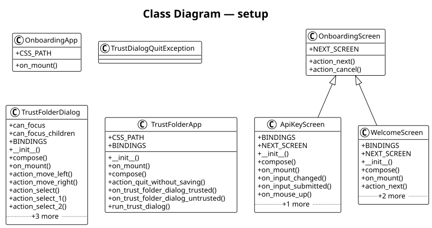

# setup

The **setup** subsystem onboarding, first-run setup, and trusted-folder management. It contains 6 modules with 7 classes, 4 functions, and approximately 517 lines of code.

## Class Diagram

## Key Components

The [**TrustFolderDialog**](https://github.com/ibrahimgb/mistral-vibe/blob/87fd92fb12b535b705a6f815cddb938721e9215d/vibe/setup/trusted_folders/trust_folder_dialog.py#L21) class (extending `CenterMiddle`). It exposes `__init__()`, `compose()`, `on_mount()`, `action_move_left()`, `action_move_right()` among 9 public methods. Internally it relies on `_update_options()`.

The [**WelcomeScreen**](https://github.com/ibrahimgb/mistral-vibe/blob/87fd92fb12b535b705a6f815cddb938721e9215d/vibe/setup/onboarding/screens/welcome.py#L46) class (extending `OnboardingScreen`). It exposes `__init__()`, `compose()`, `on_mount()`, `action_next()`.

The [**ApiKeyScreen**](https://github.com/ibrahimgb/mistral-vibe/blob/87fd92fb12b535b705a6f815cddb938721e9215d/vibe/setup/onboarding/screens/api_key.py#L34) class (extending `OnboardingScreen`). It exposes `__init__()`, `compose()`, `on_mount()`, `on_input_changed()`, `on_input_submitted()` among 6 public methods.

The [**TrustFolderApp**](https://github.com/ibrahimgb/mistral-vibe/blob/87fd92fb12b535b705a6f815cddb938721e9215d/vibe/setup/trusted_folders/trust_folder_dialog.py#L139) class (extending `App`). It exposes `__init__()`, `on_mount()`, `compose()`, `action_quit_without_saving()`, `on_trust_folder_dialog_trusted()` among 7 public methods.

The [**OnboardingScreen**](https://github.com/ibrahimgb/mistral-vibe/blob/87fd92fb12b535b705a6f815cddb938721e9215d/vibe/setup/onboarding/base.py#L6) class (extending `Screen[str | None]`). It exposes `action_next()`, `action_cancel()`.

The [**OnboardingApp**](https://github.com/ibrahimgb/mistral-vibe/blob/87fd92fb12b535b705a6f815cddb938721e9215d/vibe/setup/onboarding/__init__.py#L12) class (extending `App[str | None]`). It exposes `on_mount()`.

The [**TrustDialogQuitException**](https://github.com/ibrahimgb/mistral-vibe/blob/87fd92fb12b535b705a6f815cddb938721e9215d/vibe/setup/trusted_folders/trust_folder_dialog.py#L17) class (extending `Exception`).

## Modules

- [**vibe/setup/onboarding/__init__.py**](https://github.com/ibrahimgb/mistral-vibe/blob/87fd92fb12b535b705a6f815cddb938721e9215d/vibe/setup/onboarding/__init__.py)
- [**vibe/setup/onboarding/base.py**](https://github.com/ibrahimgb/mistral-vibe/blob/87fd92fb12b535b705a6f815cddb938721e9215d/vibe/setup/onboarding/base.py)
- [**vibe/setup/onboarding/screens/__init__.py**](https://github.com/ibrahimgb/mistral-vibe/blob/87fd92fb12b535b705a6f815cddb938721e9215d/vibe/setup/onboarding/screens/__init__.py)
- [**vibe/setup/onboarding/screens/api_key.py**](https://github.com/ibrahimgb/mistral-vibe/blob/87fd92fb12b535b705a6f815cddb938721e9215d/vibe/setup/onboarding/screens/api_key.py)
- [**vibe/setup/onboarding/screens/welcome.py**](https://github.com/ibrahimgb/mistral-vibe/blob/87fd92fb12b535b705a6f815cddb938721e9215d/vibe/setup/onboarding/screens/welcome.py)
- [**vibe/setup/trusted_folders/trust_folder_dialog.py**](https://github.com/ibrahimgb/mistral-vibe/blob/87fd92fb12b535b705a6f815cddb938721e9215d/vibe/setup/trusted_folders/trust_folder_dialog.py)
