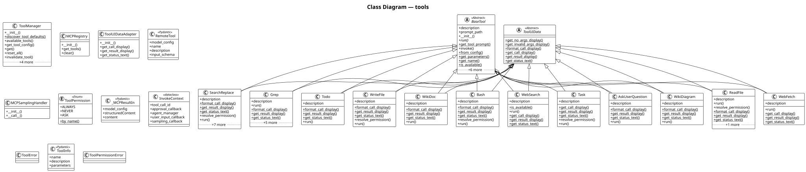

# tools

The **tools** subsystem built-in tool implementations, mcp integrations, and tool management. It contains 21 modules with 86 classes, 26 functions, and approximately 3,982 lines of code.

## Class Diagram

## Key Components

The [**SearchReplace**](https://github.com/ibrahimgb/mistral-vibe/blob/87fd92fb12b535b705a6f815cddb938721e9215d/vibe/core/tools/builtins/search_replace.py#L73) class (extending `BaseTool[SearchReplaceArgs, SearchReplaceResult, SearchReplaceConfig, BaseToolState]`, `ToolUIData[SearchReplaceArgs, SearchReplaceResult]`). It exposes `format_call_display()`, `get_result_display()`, `get_status_text()`, `resolve_permission()`, `run()`. Internally it relies on `_prepare_and_validate_args()`, `_apply_blocks()`, `_find_best_fuzzy_match()`.

The [**BaseTool**](https://github.com/ibrahimgb/mistral-vibe/blob/87fd92fb12b535b705a6f815cddb938721e9215d/vibe/core/tools/base.py#L108) abstract base class (extending `ABC`). It exposes `__init__()`, `run()`, `get_tool_prompt()`, `invoke()`, `from_config()` among 10 public methods. Internally it relies on `_get_tool_args_results()`, `_extract_result_type()`.

The [**Grep**](https://github.com/ibrahimgb/mistral-vibe/blob/87fd92fb12b535b705a6f815cddb938721e9215d/vibe/core/tools/builtins/grep.py#L97) class (extending `BaseTool[GrepArgs, GrepResult, GrepToolConfig, BaseToolState]`, `ToolUIData[GrepArgs, GrepResult]`). It exposes `run()`, `format_call_display()`, `get_result_display()`, `get_status_text()`. Internally it relies on `_build_ripgrep_command()`, `_execute_search()`.

The [**ToolManager**](https://github.com/ibrahimgb/mistral-vibe/blob/87fd92fb12b535b705a6f815cddb938721e9215d/vibe/core/tools/manager.py#L61) class manages tool discovery and instantiation for an agent. It exposes `__init__()`, `discover_tool_defaults()`, `get_tool_config()`, `get()`, `reset_all()` among 6 public methods. Internally it relies on `_iter_tool_classes()`, `_load_tools_from_file()`.

The [**ReadFile**](https://github.com/ibrahimgb/mistral-vibe/blob/87fd92fb12b535b705a6f815cddb938721e9215d/vibe/core/tools/builtins/read_file.py#L60) class (extending `BaseTool[ReadFileArgs, ReadFileResult, ReadFileToolConfig, BaseToolState]`, `ToolUIData[ReadFileArgs, ReadFileResult]`). It exposes `run()`, `resolve_permission()`, `format_call_display()`, `get_result_display()`, `get_status_text()`. Internally it relies on `_read_file()`.

The [**WebFetch**](https://github.com/ibrahimgb/mistral-vibe/blob/87fd92fb12b535b705a6f815cddb938721e9215d/vibe/core/tools/builtins/webfetch.py#L66) class (extending `BaseTool[WebFetchArgs, WebFetchResult, WebFetchConfig, BaseToolState]`, `ToolUIData[WebFetchArgs, WebFetchResult]`). It exposes `run()`, `get_call_display()`, `get_result_display()`, `get_status_text()`. Internally it relies on `_fetch_url()`.

The [**MCPRegistry**](https://github.com/ibrahimgb/mistral-vibe/blob/87fd92fb12b535b705a6f815cddb938721e9215d/vibe/core/tools/mcp/registry.py#L21) class shared cache for mcp server tool discovery. It exposes `__init__()`, `get_tools()`, `clear()`. Internally it relies on `_discover_http()`, `_discover_stdio()`.

The [**Bash**](https://github.com/ibrahimgb/mistral-vibe/blob/87fd92fb12b535b705a6f815cddb938721e9215d/vibe/core/tools/builtins/bash.py#L204) class (extending `BaseTool[BashArgs, BashResult, BashToolConfig, BaseToolState]`, `ToolUIData[BashArgs, BashResult]`). It exposes `format_call_display()`, `get_result_display()`, `get_status_text()`, `resolve_permission()`, `run()`.

The [**WikiDoc**](https://github.com/ibrahimgb/mistral-vibe/blob/87fd92fb12b535b705a6f815cddb938721e9215d/vibe/core/tools/builtins/wiki_doc.py#L69) class (extending `BaseTool[WikiDocArgs, WikiDocResult, WikiDocConfig, WikiDocState]`, `ToolUIData[WikiDocArgs, WikiDocResult]`). It exposes `format_call_display()`, `get_result_display()`, `get_status_text()`, `run()`. Internally it relies on `_analyze()`.

The [**WriteFile**](https://github.com/ibrahimgb/mistral-vibe/blob/87fd92fb12b535b705a6f815cddb938721e9215d/vibe/core/tools/builtins/write_file.py#L44) class (extending `BaseTool[WriteFileArgs, WriteFileResult, WriteFileConfig, BaseToolState]`, `ToolUIData[WriteFileArgs, WriteFileResult]`). It exposes `format_call_display()`, `get_result_display()`, `get_status_text()`, `resolve_permission()`, `run()`. Internally it relies on `_prepare_and_validate_path()`.

## Design Patterns

**Template Method — BaseTool** — `BaseTool` defines 1 abstract hook(s) (`run`) with 9 concrete method(s) providing the template. See [**base.py**](https://github.com/ibrahimgb/mistral-vibe/blob/87fd92fb12b535b705a6f815cddb938721e9215d/vibe/core/tools/base.py).

**Template Method — ToolUIData** — `ToolUIData` defines 2 abstract hook(s) (`get_result_display`, `get_status_text`) with 4 concrete method(s) providing the template. See [**ui.py**](https://github.com/ibrahimgb/mistral-vibe/blob/87fd92fb12b535b705a6f815cddb938721e9215d/vibe/core/tools/ui.py).

**Factory — BaseTool.create_config_with_permission()** — `BaseTool.create_config_with_permission()` creates `BaseToolConfig`. See [**base.py**](https://github.com/ibrahimgb/mistral-vibe/blob/87fd92fb12b535b705a6f815cddb938721e9215d/vibe/core/tools/base.py).

**Async Streaming — Bash** — `Bash` uses AsyncGenerator streaming in 1 method(s): `run`. See [**bash.py**](https://github.com/ibrahimgb/mistral-vibe/blob/87fd92fb12b535b705a6f815cddb938721e9215d/vibe/acp/tools/builtins/bash.py).

**Async Streaming — BaseTool** — `BaseTool` uses AsyncGenerator streaming in 2 method(s): `run`, `invoke`. See [**base.py**](https://github.com/ibrahimgb/mistral-vibe/blob/87fd92fb12b535b705a6f815cddb938721e9215d/vibe/core/tools/base.py).

**Async Streaming — AskUserQuestion** — `AskUserQuestion` uses AsyncGenerator streaming in 1 method(s): `run`. See [**ask_user_question.py**](https://github.com/ibrahimgb/mistral-vibe/blob/87fd92fb12b535b705a6f815cddb938721e9215d/vibe/core/tools/builtins/ask_user_question.py).

**Async Streaming — Bash** — `Bash` uses AsyncGenerator streaming in 1 method(s): `run`. See [**bash.py**](https://github.com/ibrahimgb/mistral-vibe/blob/87fd92fb12b535b705a6f815cddb938721e9215d/vibe/core/tools/builtins/bash.py).

**Async Streaming — Grep** — `Grep` uses AsyncGenerator streaming in 1 method(s): `run`. See [**grep.py**](https://github.com/ibrahimgb/mistral-vibe/blob/87fd92fb12b535b705a6f815cddb938721e9215d/vibe/core/tools/builtins/grep.py).

**Async Streaming — ReadFile** — `ReadFile` uses AsyncGenerator streaming in 1 method(s): `run`. See [**read_file.py**](https://github.com/ibrahimgb/mistral-vibe/blob/87fd92fb12b535b705a6f815cddb938721e9215d/vibe/core/tools/builtins/read_file.py).

**Async Streaming — SearchReplace** — `SearchReplace` uses AsyncGenerator streaming in 1 method(s): `run`. See [**search_replace.py**](https://github.com/ibrahimgb/mistral-vibe/blob/87fd92fb12b535b705a6f815cddb938721e9215d/vibe/core/tools/builtins/search_replace.py).

**Async Streaming — Task** — `Task` uses AsyncGenerator streaming in 1 method(s): `run`. See [**task.py**](https://github.com/ibrahimgb/mistral-vibe/blob/87fd92fb12b535b705a6f815cddb938721e9215d/vibe/core/tools/builtins/task.py).

**Async Streaming — Todo** — `Todo` uses AsyncGenerator streaming in 1 method(s): `run`. See [**todo.py**](https://github.com/ibrahimgb/mistral-vibe/blob/87fd92fb12b535b705a6f815cddb938721e9215d/vibe/core/tools/builtins/todo.py).

**Async Streaming — WebFetch** — `WebFetch` uses AsyncGenerator streaming in 1 method(s): `run`. See [**webfetch.py**](https://github.com/ibrahimgb/mistral-vibe/blob/87fd92fb12b535b705a6f815cddb938721e9215d/vibe/core/tools/builtins/webfetch.py).

**Async Streaming — WebSearch** — `WebSearch` uses AsyncGenerator streaming in 1 method(s): `run`. See [**websearch.py**](https://github.com/ibrahimgb/mistral-vibe/blob/87fd92fb12b535b705a6f815cddb938721e9215d/vibe/core/tools/builtins/websearch.py).

**Async Streaming — WikiDiagram** — `WikiDiagram` uses AsyncGenerator streaming in 1 method(s): `run`. See [**wiki_diagram.py**](https://github.com/ibrahimgb/mistral-vibe/blob/87fd92fb12b535b705a6f815cddb938721e9215d/vibe/core/tools/builtins/wiki_diagram.py).

**Async Streaming — WikiDoc** — `WikiDoc` uses AsyncGenerator streaming in 1 method(s): `run`. See [**wiki_doc.py**](https://github.com/ibrahimgb/mistral-vibe/blob/87fd92fb12b535b705a6f815cddb938721e9215d/vibe/core/tools/builtins/wiki_doc.py).

**Async Streaming — WriteFile** — `WriteFile` uses AsyncGenerator streaming in 1 method(s): `run`. See [**write_file.py**](https://github.com/ibrahimgb/mistral-vibe/blob/87fd92fb12b535b705a6f815cddb938721e9215d/vibe/core/tools/builtins/write_file.py).

**Async Streaming — _mcp_stderr_capture()** — `_mcp_stderr_capture()` in `vibe.core.tools.mcp.tools` yields an async stream. See [**tools.py**](https://github.com/ibrahimgb/mistral-vibe/blob/87fd92fb12b535b705a6f815cddb938721e9215d/vibe/core/tools/mcp/tools.py).

**Auto-Discovery — ToolManager** — `ToolManager` auto-discovers plugins via `_iter_tool_classes()`, `_load_tools_from_file()`, `discover_tool_defaults()`. See [**manager.py**](https://github.com/ibrahimgb/mistral-vibe/blob/87fd92fb12b535b705a6f815cddb938721e9215d/vibe/core/tools/manager.py).

**Config-as-Code — BaseToolConfig** — `BaseToolConfig` in `vibe.core.tools.base` uses Pydantic for typed configuration with 4 field(s). See [**base.py**](https://github.com/ibrahimgb/mistral-vibe/blob/87fd92fb12b535b705a6f815cddb938721e9215d/vibe/core/tools/base.py).

**Config-as-Code — AskUserQuestionConfig** — `AskUserQuestionConfig` in `vibe.core.tools.builtins.ask_user_question` uses Pydantic for typed configuration with 1 field(s). See [**ask_user_question.py**](https://github.com/ibrahimgb/mistral-vibe/blob/87fd92fb12b535b705a6f815cddb938721e9215d/vibe/core/tools/builtins/ask_user_question.py).

**Config-as-Code — BashToolConfig** — `BashToolConfig` in `vibe.core.tools.builtins.bash` uses Pydantic for typed configuration with 6 field(s). See [**bash.py**](https://github.com/ibrahimgb/mistral-vibe/blob/87fd92fb12b535b705a6f815cddb938721e9215d/vibe/core/tools/builtins/bash.py).

**Config-as-Code — GrepToolConfig** — `GrepToolConfig` in `vibe.core.tools.builtins.grep` uses Pydantic for typed configuration with 6 field(s). See [**grep.py**](https://github.com/ibrahimgb/mistral-vibe/blob/87fd92fb12b535b705a6f815cddb938721e9215d/vibe/core/tools/builtins/grep.py).

**Config-as-Code — ReadFileToolConfig** — `ReadFileToolConfig` in `vibe.core.tools.builtins.read_file` uses Pydantic for typed configuration with 2 field(s). See [**read_file.py**](https://github.com/ibrahimgb/mistral-vibe/blob/87fd92fb12b535b705a6f815cddb938721e9215d/vibe/core/tools/builtins/read_file.py).

**Config-as-Code — SearchReplaceConfig** — `SearchReplaceConfig` in `vibe.core.tools.builtins.search_replace` uses Pydantic for typed configuration with 3 field(s). See [**search_replace.py**](https://github.com/ibrahimgb/mistral-vibe/blob/87fd92fb12b535b705a6f815cddb938721e9215d/vibe/core/tools/builtins/search_replace.py).

**Config-as-Code — TaskToolConfig** — `TaskToolConfig` in `vibe.core.tools.builtins.task` uses Pydantic for typed configuration with 2 field(s). See [**task.py**](https://github.com/ibrahimgb/mistral-vibe/blob/87fd92fb12b535b705a6f815cddb938721e9215d/vibe/core/tools/builtins/task.py).

**Config-as-Code — TodoConfig** — `TodoConfig` in `vibe.core.tools.builtins.todo` uses Pydantic for typed configuration with 2 field(s). See [**todo.py**](https://github.com/ibrahimgb/mistral-vibe/blob/87fd92fb12b535b705a6f815cddb938721e9215d/vibe/core/tools/builtins/todo.py).

**Config-as-Code — WebFetchConfig** — `WebFetchConfig` in `vibe.core.tools.builtins.webfetch` uses Pydantic for typed configuration with 5 field(s). See [**webfetch.py**](https://github.com/ibrahimgb/mistral-vibe/blob/87fd92fb12b535b705a6f815cddb938721e9215d/vibe/core/tools/builtins/webfetch.py).

**Config-as-Code — WebSearchConfig** — `WebSearchConfig` in `vibe.core.tools.builtins.websearch` uses Pydantic for typed configuration with 3 field(s). See [**websearch.py**](https://github.com/ibrahimgb/mistral-vibe/blob/87fd92fb12b535b705a6f815cddb938721e9215d/vibe/core/tools/builtins/websearch.py).

**Config-as-Code — WikiDiagramConfig** — `WikiDiagramConfig` in `vibe.core.tools.builtins.wiki_diagram` uses Pydantic for typed configuration with 3 field(s). See [**wiki_diagram.py**](https://github.com/ibrahimgb/mistral-vibe/blob/87fd92fb12b535b705a6f815cddb938721e9215d/vibe/core/tools/builtins/wiki_diagram.py).

**Config-as-Code — WikiDocConfig** — `WikiDocConfig` in `vibe.core.tools.builtins.wiki_doc` uses Pydantic for typed configuration with 1 field(s). See [**wiki_doc.py**](https://github.com/ibrahimgb/mistral-vibe/blob/87fd92fb12b535b705a6f815cddb938721e9215d/vibe/core/tools/builtins/wiki_doc.py).

**Config-as-Code — WriteFileConfig** — `WriteFileConfig` in `vibe.core.tools.builtins.write_file` uses Pydantic for typed configuration with 3 field(s). See [**write_file.py**](https://github.com/ibrahimgb/mistral-vibe/blob/87fd92fb12b535b705a6f815cddb938721e9215d/vibe/core/tools/builtins/write_file.py).

## Modules

- [**vibe/core/tools/base.py**](https://github.com/ibrahimgb/mistral-vibe/blob/87fd92fb12b535b705a6f815cddb938721e9215d/vibe/core/tools/base.py)
- [**vibe/core/tools/builtins/ask_user_question.py**](https://github.com/ibrahimgb/mistral-vibe/blob/87fd92fb12b535b705a6f815cddb938721e9215d/vibe/core/tools/builtins/ask_user_question.py)
- [**vibe/core/tools/builtins/bash.py**](https://github.com/ibrahimgb/mistral-vibe/blob/87fd92fb12b535b705a6f815cddb938721e9215d/vibe/core/tools/builtins/bash.py)
- [**vibe/core/tools/builtins/grep.py**](https://github.com/ibrahimgb/mistral-vibe/blob/87fd92fb12b535b705a6f815cddb938721e9215d/vibe/core/tools/builtins/grep.py)
- [**vibe/core/tools/builtins/prompts/__init__.py**](https://github.com/ibrahimgb/mistral-vibe/blob/87fd92fb12b535b705a6f815cddb938721e9215d/vibe/core/tools/builtins/prompts/__init__.py)
- [**vibe/core/tools/builtins/read_file.py**](https://github.com/ibrahimgb/mistral-vibe/blob/87fd92fb12b535b705a6f815cddb938721e9215d/vibe/core/tools/builtins/read_file.py)
- [**vibe/core/tools/builtins/search_replace.py**](https://github.com/ibrahimgb/mistral-vibe/blob/87fd92fb12b535b705a6f815cddb938721e9215d/vibe/core/tools/builtins/search_replace.py)
- [**vibe/core/tools/builtins/task.py**](https://github.com/ibrahimgb/mistral-vibe/blob/87fd92fb12b535b705a6f815cddb938721e9215d/vibe/core/tools/builtins/task.py)
- [**vibe/core/tools/builtins/todo.py**](https://github.com/ibrahimgb/mistral-vibe/blob/87fd92fb12b535b705a6f815cddb938721e9215d/vibe/core/tools/builtins/todo.py)
- [**vibe/core/tools/builtins/webfetch.py**](https://github.com/ibrahimgb/mistral-vibe/blob/87fd92fb12b535b705a6f815cddb938721e9215d/vibe/core/tools/builtins/webfetch.py)
- [**vibe/core/tools/builtins/websearch.py**](https://github.com/ibrahimgb/mistral-vibe/blob/87fd92fb12b535b705a6f815cddb938721e9215d/vibe/core/tools/builtins/websearch.py)
- [**vibe/core/tools/builtins/wiki_diagram.py**](https://github.com/ibrahimgb/mistral-vibe/blob/87fd92fb12b535b705a6f815cddb938721e9215d/vibe/core/tools/builtins/wiki_diagram.py) — PlantUML diagram generation tool — create and render diagrams as SVG.
- [**vibe/core/tools/builtins/wiki_doc.py**](https://github.com/ibrahimgb/mistral-vibe/blob/87fd92fb12b535b705a6f815cddb938721e9215d/vibe/core/tools/builtins/wiki_doc.py) — Wiki documentation tool — build, manage, and query the Code Wiki.
- [**vibe/core/tools/builtins/write_file.py**](https://github.com/ibrahimgb/mistral-vibe/blob/87fd92fb12b535b705a6f815cddb938721e9215d/vibe/core/tools/builtins/write_file.py)
- [**vibe/core/tools/manager.py**](https://github.com/ibrahimgb/mistral-vibe/blob/87fd92fb12b535b705a6f815cddb938721e9215d/vibe/core/tools/manager.py)
- [**vibe/core/tools/mcp/__init__.py**](https://github.com/ibrahimgb/mistral-vibe/blob/87fd92fb12b535b705a6f815cddb938721e9215d/vibe/core/tools/mcp/__init__.py)
- [**vibe/core/tools/mcp/registry.py**](https://github.com/ibrahimgb/mistral-vibe/blob/87fd92fb12b535b705a6f815cddb938721e9215d/vibe/core/tools/mcp/registry.py)
- [**vibe/core/tools/mcp/tools.py**](https://github.com/ibrahimgb/mistral-vibe/blob/87fd92fb12b535b705a6f815cddb938721e9215d/vibe/core/tools/mcp/tools.py)
- [**vibe/core/tools/mcp_sampling.py**](https://github.com/ibrahimgb/mistral-vibe/blob/87fd92fb12b535b705a6f815cddb938721e9215d/vibe/core/tools/mcp_sampling.py)
- [**vibe/core/tools/ui.py**](https://github.com/ibrahimgb/mistral-vibe/blob/87fd92fb12b535b705a6f815cddb938721e9215d/vibe/core/tools/ui.py)
- [**vibe/core/tools/utils.py**](https://github.com/ibrahimgb/mistral-vibe/blob/87fd92fb12b535b705a6f815cddb938721e9215d/vibe/core/tools/utils.py)
