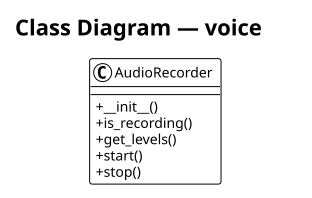

# voice

The **voice** subsystem voice recording and transcription. It contains 3 modules with 1 classes, 2 functions, and approximately 212 lines of code.

## Class Diagram

## Key Components

The [**AudioRecorder**](https://github.com/ibrahimgb/mistral-vibe/blob/87fd92fb12b535b705a6f815cddb938721e9215d/vibe/core/voice/recorder.py#L51) class records audio from the microphone using *sounddevice*. It exposes `__init__()`, `get_levels()`, `start()`, `stop()`. Internally it relies on `_audio_callback()`.

## Modules

- [**vibe/core/voice/__init__.py**](https://github.com/ibrahimgb/mistral-vibe/blob/87fd92fb12b535b705a6f815cddb938721e9215d/vibe/core/voice/__init__.py)
- [**vibe/core/voice/recorder.py**](https://github.com/ibrahimgb/mistral-vibe/blob/87fd92fb12b535b705a6f815cddb938721e9215d/vibe/core/voice/recorder.py) — Audio recorder using sounddevice callback streams.
- [**vibe/core/voice/transcriber.py**](https://github.com/ibrahimgb/mistral-vibe/blob/87fd92fb12b535b705a6f815cddb938721e9215d/vibe/core/voice/transcriber.py) — Transcribe audio via Voxtral (Mistral multimodal chat completions).
