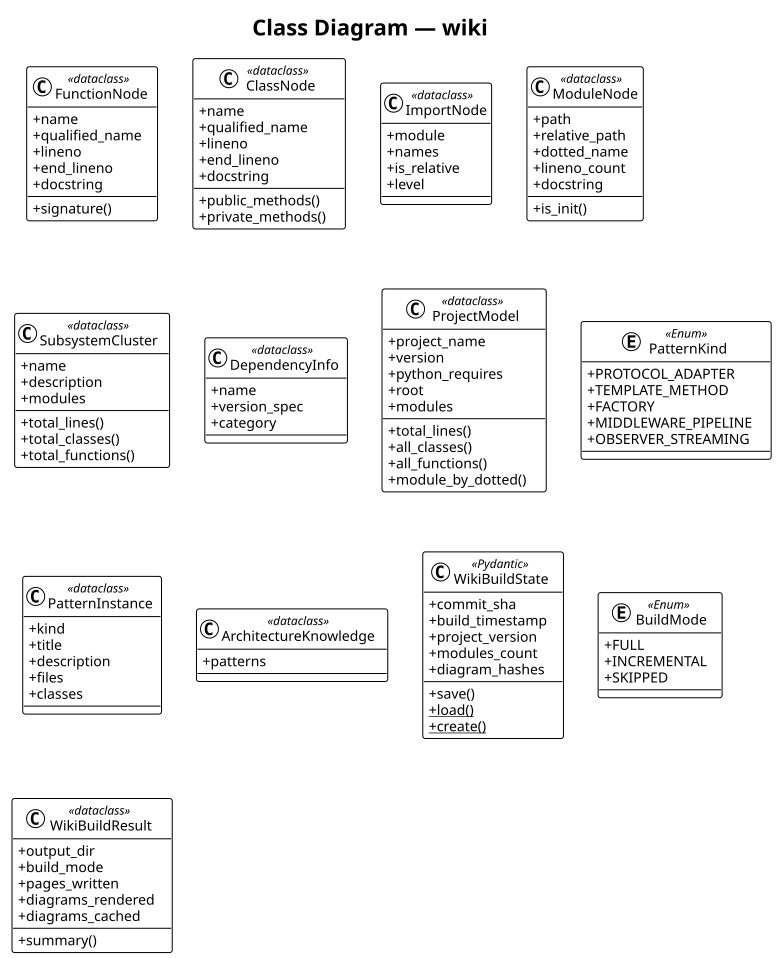

# wiki

The **wiki** subsystem code wiki documentation generator (this system). It contains 10 modules with 13 classes, 83 functions, and approximately 2,967 lines of code.

## Class Diagram

## Key Components

The [**ProjectModel**](https://github.com/ibrahimgb/mistral-vibe/blob/87fd92fb12b535b705a6f815cddb938721e9215d/vibe/core/wiki/analyzer.py#L145) dataclass top-level analysis result for the entire project. Key fields include `project_name`, `version`, `python_requires`, `root`, `modules`, `subsystems`, `dependencies`, `import_graph`, …. It exposes `module_by_dotted()`.

The [**SubsystemCluster**](https://github.com/ibrahimgb/mistral-vibe/blob/87fd92fb12b535b705a6f815cddb938721e9215d/vibe/core/wiki/analyzer.py#L115) dataclass a logical subsystem grouping (e.g. ``cli``, ``core``, ``acp``). Key fields include `name`, `description`, `modules`.

The [**WikiBuildState**](https://github.com/ibrahimgb/mistral-vibe/blob/87fd92fb12b535b705a6f815cddb938721e9215d/vibe/core/wiki/build_state.py#L24) Pydantic model (extending `BaseModel`) serialisable snapshot of the last successful wiki build. Key fields include `commit_sha`, `build_timestamp`, `project_version`, `modules_count`, `diagram_hashes`. It exposes `save()`, `load()`, `create()`.

The [**ClassNode**](https://github.com/ibrahimgb/mistral-vibe/blob/87fd92fb12b535b705a6f815cddb938721e9215d/vibe/core/wiki/analyzer.py#L57) dataclass one class definition. Key fields include `name`, `qualified_name`, `lineno`, `end_lineno`, `docstring`, `bases`, `decorators`, `methods`, ….

The [**FunctionNode**](https://github.com/ibrahimgb/mistral-vibe/blob/87fd92fb12b535b705a6f815cddb938721e9215d/vibe/core/wiki/analyzer.py#L29) dataclass one function or method. Key fields include `name`, `qualified_name`, `lineno`, `end_lineno`, `docstring`, `parameters`, `return_annotation`, `decorators`, ….

The [**ModuleNode**](https://github.com/ibrahimgb/mistral-vibe/blob/87fd92fb12b535b705a6f815cddb938721e9215d/vibe/core/wiki/analyzer.py#L95) dataclass one python file. Key fields include `path`, `relative_path`, `dotted_name`, `lineno_count`, `docstring`, `imports`, `classes`, `functions`, ….

The [**WikiBuildResult**](https://github.com/ibrahimgb/mistral-vibe/blob/87fd92fb12b535b705a6f815cddb938721e9215d/vibe/core/wiki/site_builder.py#L55) dataclass outcome of a full wiki build. Key fields include `output_dir`, `build_mode`, `pages_written`, `diagrams_rendered`, `diagrams_cached`, `diagrams_failed`, `llm_files_written`, `json_artefacts_written`, ….

The [**ImportNode**](https://github.com/ibrahimgb/mistral-vibe/blob/87fd92fb12b535b705a6f815cddb938721e9215d/vibe/core/wiki/analyzer.py#L85) dataclass one import statement. Key fields include `module`, `names`, `is_relative`, `level`.

The [**DependencyInfo**](https://github.com/ibrahimgb/mistral-vibe/blob/87fd92fb12b535b705a6f815cddb938721e9215d/vibe/core/wiki/analyzer.py#L136) dataclass project-level dependency metadata from pyproject.toml. Key fields include `name`, `version_spec`, `category`.

The [**PatternKind**](https://github.com/ibrahimgb/mistral-vibe/blob/87fd92fb12b535b705a6f815cddb938721e9215d/vibe/core/wiki/architecture.py#L21) enum (extending `StrEnum`) well-known software design patterns we detect. Key fields include `PROTOCOL_ADAPTER`, `TEMPLATE_METHOD`, `FACTORY`, `MIDDLEWARE_PIPELINE`, `OBSERVER_STREAMING`, `AUTODISCOVERY`, `CONFIG_AS_CODE`.

## Design Patterns

**Factory — build_wiki_site()** — `build_wiki_site()` in `vibe.core.wiki.site_builder` creates `WikiBuildResult`. See [**site_builder.py**](https://github.com/ibrahimgb/mistral-vibe/blob/87fd92fb12b535b705a6f815cddb938721e9215d/vibe/core/wiki/site_builder.py).

## Modules

- [**vibe/core/wiki/__init__.py**](https://github.com/ibrahimgb/mistral-vibe/blob/87fd92fb12b535b705a6f815cddb938721e9215d/vibe/core/wiki/__init__.py) — Code Wiki — dual-output documentation generator for Mistral Vibe.
- [**vibe/core/wiki/analyzer.py**](https://github.com/ibrahimgb/mistral-vibe/blob/87fd92fb12b535b705a6f815cddb938721e9215d/vibe/core/wiki/analyzer.py) — Deep static analysis of a Python project — foundation for wiki generation.
- [**vibe/core/wiki/architecture.py**](https://github.com/ibrahimgb/mistral-vibe/blob/87fd92fb12b535b705a6f815cddb938721e9215d/vibe/core/wiki/architecture.py) — Extract design-pattern knowledge from a :class:`ProjectModel`.
- [**vibe/core/wiki/build_state.py**](https://github.com/ibrahimgb/mistral-vibe/blob/87fd92fb12b535b705a6f815cddb938721e9215d/vibe/core/wiki/build_state.py) — Persistent build state for incremental wiki rebuilds.
- [**vibe/core/wiki/diagrams.py**](https://github.com/ibrahimgb/mistral-vibe/blob/87fd92fb12b535b705a6f815cddb938721e9215d/vibe/core/wiki/diagrams.py) — Auto-generate PlantUML diagrams from a :class:`ProjectModel`.
- [**vibe/core/wiki/llm_doc.py**](https://github.com/ibrahimgb/mistral-vibe/blob/87fd92fb12b535b705a6f815cddb938721e9215d/vibe/core/wiki/llm_doc.py) — LLM-optimised renderer — flat Markdown for ``llms.txt`` and ``llms-full.txt``.
- [**vibe/core/wiki/narrative.py**](https://github.com/ibrahimgb/mistral-vibe/blob/87fd92fb12b535b705a6f815cddb938721e9215d/vibe/core/wiki/narrative.py) — Developer-facing renderer — Gemini Code Wiki style narrative Markdown.
- [**vibe/core/wiki/plantuml.py**](https://github.com/ibrahimgb/mistral-vibe/blob/87fd92fb12b535b705a6f815cddb938721e9215d/vibe/core/wiki/plantuml.py) — PlantUML rendering utilities — local binary or public server fallback.
- [**vibe/core/wiki/site_builder.py**](https://github.com/ibrahimgb/mistral-vibe/blob/87fd92fb12b535b705a6f815cddb938721e9215d/vibe/core/wiki/site_builder.py) — Site builder — orchestrates the full wiki generation pipeline.
- [**vibe/core/wiki/source_linker.py**](https://github.com/ibrahimgb/mistral-vibe/blob/87fd92fb12b535b705a6f815cddb938721e9215d/vibe/core/wiki/source_linker.py) — Git remote detection and source-link generation for wiki documentation.
